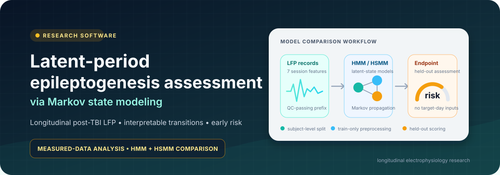
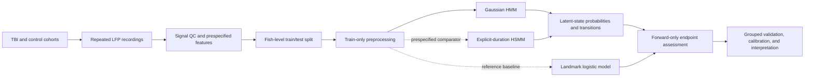

<p align="center">
  
</p>

<h1 align="center">Latent-Period Epileptogenesis Assessment via Markov Modeling</h1>

<p align="center">
  An interpretable longitudinal electrophysiology workflow for identifying
  post-injury brain-state transitions and evaluating early risk signals.
</p>

<p align="center">
  <a href="https://github.com/josephreggy23-coder/Latent-Period-Epileptogenesis-Assessment-Via-Markov-Modeling/actions/workflows/ci.yml"></a>
  
  
  
  
</p>

<p align="center">
  <a href="#research-objective">Objective</a> •
  <a href="#model-comparison">Models</a> •
  <a href="#analysis-workflow">Workflow</a> •
  <a href="#data-and-provenance">Data</a> •
  <a href="#evaluation-plan">Evaluation</a> •
  <a href="#quick-start">Quick start</a> •
  <a href="#scientific-scope">Scope</a>
</p>

## Research objective

This project asks whether longitudinal electrophysiological measurements after
traumatic brain injury can be represented as a sequence of interpretable latent
states, and whether early state dynamics are associated with a later
prespecified neurological endpoint.

The emphasis is the scientific question—not a leaderboard:

| Objective | Output |
|---|---|
| Identify recurring electrophysiological regimes | Posterior probability of each latent state at every observation |
| Quantify progression and recovery | Transition, occupancy, worsening, recovery, and persistence summaries |
| Assess an early signal | Forward-only endpoint probability using observations available before the target day |
| Separate temporal value from static prediction | HMM/HSMM comparison plus a non-temporal landmark baseline |
| Preserve interpretability | Explicit features, transition matrices, fish-level splits, and auditable tables |

The inferred states are statistical summaries. They become biological claims
only after external validation against independently defined phenotypes,
histology, behavior, or seizure outcomes.

## Why a Markov model?

Epileptogenesis is a progression problem. A single classifier can estimate an
endpoint from one snapshot, but it does not directly describe how an animal
moves between lower- and higher-burden electrophysiological regimes.

A hidden Markov model (HMM) provides:

- a probability distribution over latent states rather than a forced label;
- a transition matrix that permits stability, worsening, and recovery;
- forward filtering that uses only observations available at that time;
- interpretable state occupancy and transition summaries;
- a natural way to propagate an early state distribution toward a later
  endpoint.

This is consistent with prior work using an HMM to decode stages of
epileptogenesis from longitudinal hippocampal evoked potentials
([Meyer et al., 2016](https://doi.org/10.1109/ICMLA.2016.0033)).

## Model comparison

### Primary model: Gaussian HMM

The implemented model is a diagonal-Gaussian HMM over prespecified
electrophysiological features. It assumes that the next latent state depends on
the current state and that state persistence follows the transition matrix.

### Closest comparator: hidden semi-Markov model

The most relevant like-for-like comparator is a **hidden semi-Markov model
(HSMM)**. It keeps the same latent-state interpretation but models how long the
process remains in each state explicitly. That distinction matters when a
latent or recovery stage has a characteristic duration that a standard HMM's
implicit geometric dwell-time distribution cannot represent well.

HSMMs have been used to model EEG state duration
([Chakravarty et al., 2019](https://doi.org/10.1109/EMBC.2019.8856802)), and a
recent epilepsy study directly compared HMM and HSMM formulations for dynamic
brain-state analysis
([Amoiridou et al.](https://doi.org/10.1007/s11571-025-10382-3)).

| Question | Gaussian HMM | Explicit-duration HSMM |
|---|---|---|
| What is hidden? | Discrete electrophysiological state | The same state plus its dwell duration |
| State persistence | Implied by self-transition probability | Estimated with an explicit duration distribution |
| Main strength | Parsimonious and practical for shorter panels | Better representation of persistent stages |
| Main risk | Can switch too often when durations are non-geometric | More parameters and greater overfitting risk |
| Best use here | Primary interpretable state model | Prespecified sensitivity/comparator model |
| Evidence needed | Stable states and held-out predictive value | Better grouped CV/calibration and stable duration estimates |

The repository currently implements the HMM. The HSMM is the recommended
comparison model; this README does not invent comparative scores that have not
been estimated. An HSMM comparison should be run only when the measured
recording schedule provides enough longitudinal or within-recording windows to
identify state-duration distributions.

### Non-temporal reference baseline

An elastic-net logistic landmark model should also be evaluated on the same
early feature window. It is not a latent-state model; its role is to test
whether Markov dynamics add value beyond a regularized static predictor.

## Analysis workflow



For a held-out subject, the early forecast uses only that subject's
pre-endpoint observations. Training-subject observations may be used to learn
the state emission and transition parameters. This distinction prevents target
day leakage without discarding information needed to estimate the longitudinal
model.

## Data and provenance

The repository contains normalized longitudinal LFP, outcome, and behavioral
tables in [`data/template/`](data/template/):

| File | Key | Role |
|---|---|---|
| [`tbi_4_6dpf_lfp_timeseries.csv`](data/template/tbi_4_6dpf_lfp_timeseries.csv) | `fish_id`, `dpf` | Acquisition, QC, and electrophysiological session features |
| [`tbi_4_6dpf_fish_outcomes.csv`](data/template/tbi_4_6dpf_fish_outcomes.csv) | `fish_id` | Injury metadata, follow-up, and endpoint |
| [`tbi_4_6dpf_dlc_behavior.csv`](data/template/tbi_4_6dpf_dlc_behavior.csv) | `fish_id`, `dpf` | Behavioral and pose-derived validation variables |
| [`tbi_4_6dpf_dataset_manifest.json`](data/template/tbi_4_6dpf_dataset_manifest.json) | — | Definitions, provenance, sources, and file hashes |
| [`TBI_4_6dpf_data_template.xlsx`](data/template/TBI_4_6dpf_data_template.xlsx) | — | Human-readable review workbook |

> [!IMPORTANT]
> The analysis is intended for measured records. Before treating any numerical
> output as a study finding, confirm that the CSV provenance fields and manifest
> describe the actual source, units, QC decisions, and endpoint definition. In
> the current checkout, rows carrying `placeholder_pending_replacement` are
> blocked by default. If the included files are the measured study records,
> update those status fields and the manifest only after provenance has been
> verified.

The CSV files are the analysis inputs. The workbook is a review snapshot and
does not silently override the normalized tables.

### Electrophysiological feature set

The HMM uses a strict feature allowlist:

```text
lfp_mean_uv
lfp_variance_uv2
lfp_skewness
lfp_kurtosis
lfp_fourth_power_mean_uv4
lfp_seizure_event_rate_per_h
lfp_ica_complexity
```

Group, injury dose, batch, quality-control flags, behavior, outcomes, and
`*_TRUTH` columns are excluded from model inputs. Positive heavy-tailed
features receive `log1p`, and robust scaling is estimated from training subjects
only.

Field definitions and replacement rules are documented in
[`data/README.md`](data/README.md).

## Statistical design

1. **Validate the tables.** Enforce required fields, unique keys, valid domains,
   numeric bounds, temporal consistency, and cross-table agreement.
2. **Apply session QC.** Retain auditable failure reasons and terminate a
   subject's usable prefix at the first temporal gap.
3. **Split by subject.** Keep every observation from one animal in exactly one
   partition.
4. **Fit preprocessing on training subjects.** No held-out distribution
   information enters transformations or scaling.
5. **Compare state counts on training data.** Use BIC and grouped
   cross-validated log likelihood; treat a selected upper boundary as
   unresolved rather than definitive.
6. **Align states without endpoint labels.** Order statistical states with a
   prespecified electrophysiological severity direction.
7. **Filter forward.** At time \(t\), use measurements through \(t\), never
   future observations.
8. **Evaluate on held-out subjects.** Report state stability, transition
   summaries, discrimination, calibration, and uncertainty.

Here, **causal filtering** is a signal-processing term for forward-only
inference. It does not mean causal-effect estimation.

## Evaluation plan

All candidate models should use the same subject-level partitions and the same
endpoint definition.

| Domain | Primary comparison |
|---|---|
| Fit | Grouped cross-validated log likelihood and BIC |
| State usefulness | Occupancy separation, transition stability, and posterior entropy |
| Forecast discrimination | ROC-AUC and average precision |
| Calibration | Brier score, calibration slope/intercept, and reliability curve |
| Operating point | Sensitivity, specificity, PPV, and NPV at a prospectively chosen threshold |
| Robustness | Leave-one-batch/site-out analysis and bootstrap intervals by subject |
| HMM versus HSMM | Held-out fit, calibration, switch count, and duration plausibility |
| Temporal value | Improvement over the landmark logistic baseline |

Model selection and threshold selection must be nested inside training data.
The final test partition should be evaluated once.

## Existing analysis artifacts

No files have been removed. The current working outputs remain available for
audit and comparison:

| Artifact | Contents |
|---|---|
| [`results/TBI_MODEL_RESULTS.md`](results/TBI_MODEL_RESULTS.md) | Generated run report |
| [`results/tbi_model_metrics.json`](results/tbi_model_metrics.json) | Machine-readable model, preprocessing, and evaluation metadata |
| [`tbi_split_assignments.csv`](results/tables/tbi_split_assignments.csv) | Subject-level partition audit |
| [`tbi_scored_test_sessions.csv`](results/tables/tbi_scored_test_sessions.csv) | Held-out state scores by session |
| [`tbi_early_predictions.csv`](results/tables/tbi_early_predictions.csv) | Per-subject endpoint probabilities |
| [`tbi_state_occupancy.csv`](results/tables/tbi_state_occupancy.csv) | Group-by-time state summaries |
| [`tbi_group_transition_summary.csv`](results/tables/tbi_group_transition_summary.csv) | Stability, worsening, and recovery summaries |
| [`tbi_transition_matrix.csv`](results/tables/tbi_transition_matrix.csv) | Ordered transition matrix |

Diagnostic figures are stored in [`results/figures/`](results/figures/). Treat
the existing numerical artifacts as working outputs until the provenance status
described above has been confirmed.

## Quick start

### Install

```bash
git clone https://github.com/josephreggy23-coder/Latent-Period-Epileptogenesis-Assessment-Via-Markov-Modeling.git
cd Latent-Period-Epileptogenesis-Assessment-Via-Markov-Modeling
python -m venv .venv
python -m pip install -e ".[dev]"
```

PowerShell activation:

```powershell
.\.venv\Scripts\Activate.ps1
```

macOS/Linux activation:

```bash
source .venv/bin/activate
```

### Run verified measured records

After confirming provenance and marking completed rows `analysis_ready`:

```bash
tbi-analyze \
  --data-dir data/template \
  --output-dir build/study-results
```

For a separate study directory:

```bash
tbi-analyze \
  --data-dir data/my-study \
  --output-dir build/my-study-results
```

The normal workflow intentionally refuses unresolved placeholder rows. Raw-LFP
feature extraction and pose estimation must be validated upstream before their
summaries enter these tables.

### Verify the software

```bash
python -m pytest
python -m compileall -q src scripts
```

## Repository layout

```text
.
|-- data/
|   |-- README.md                  data dictionary and provenance guide
|   `-- template/                  normalized tables, manifest, and workbook
|-- docs/
|   |-- METHODS.md                 scientific and statistical methods
|   |-- REPRODUCIBILITY.md         execution and leakage safeguards
|   `-- assets/                    README visual identity
|-- results/
|   |-- figures/                   diagnostic plots
|   |-- tables/                    subject-level and summary outputs
|   |-- TBI_MODEL_RESULTS.md       generated analysis report
|   `-- tbi_model_metrics.json     machine-readable run metadata
|-- scripts/                       command-line wrappers
|-- src/tbi_markov/                HMM implementation and analysis pipeline
|-- tests/                         schema, temporal, HMM, and pipeline tests
|-- CITATION.cff
|-- CONTRIBUTING.md
|-- pyproject.toml
`-- README.md
```

## Scientific scope

This repository can support:

- probabilistic description of longitudinal electrophysiological states;
- comparison of state occupancy and transitions across prespecified groups;
- forward-only assessment of a later endpoint;
- model comparison under subject-level validation;
- reproducible generation of auditable tables and figures.

It does not, by itself, establish:

- that an inferred statistical state is a biological stage of
  epileptogenesis;
- that an injury exposure causes a particular state transition;
- that a threshold is diagnostic or clinically deployable;
- that a model validated in one species, site, or acquisition protocol
  generalizes to another.

An HSMM also cannot be estimated credibly from a very short sequence solely
because it is more flexible. If only a few daily observations are available,
the primary HMM and a static baseline are the defensible comparison; duration
modeling requires denser within-recording windows or longer follow-up.

## Related work

1. Meyer FG, Benison AM, Smith Z, Barth DS. *Decoding Epileptogenesis in a
   Reduced State Space.* ICMLA. 2016:152–157.
   [doi:10.1109/ICMLA.2016.0033](https://doi.org/10.1109/ICMLA.2016.0033)
2. Amoiridou D, Kakkos I, Gkiatis K, et al. *Dynamic temporal patterns of DMN
   connectivity in epilepsy using hidden (semi-) Markov models.*
   [doi:10.1007/s11571-025-10382-3](https://doi.org/10.1007/s11571-025-10382-3)
3. Chakravarty S, Baum TE, An J, Kahali P, Brown EN. *A hidden semi-Markov model
   for estimating burst suppression EEG.* EMBC. 2019:7076–7079.
   [doi:10.1109/EMBC.2019.8856802](https://doi.org/10.1109/EMBC.2019.8856802)
4. Vespa PM, Shrestha V, Abend N, et al. *The Epilepsy Bioinformatics Study for
   Anti-Epileptogenic Therapy (EpiBioS4Rx) Clinical Biomarker: Study Design and
   Protocol.* Neurobiology of Disease. 2019;123:110–114.
   [doi:10.1016/j.nbd.2018.07.025](https://doi.org/10.1016/j.nbd.2018.07.025)
5. Locskai LF, Gill T, Tan SAW, et al. *A larval zebrafish model of traumatic
   brain injury: optimizing the dose of neurotrauma for discovery of treatments
   and aetiology.* Biology Open. 2025;14(2):bio060601.
   [doi:10.1242/bio.060601](https://doi.org/10.1242/bio.060601)
6. Eimon PM, Ghannad-Rezaie M, De Rienzo G, et al. *Brain activity patterns in
   high-throughput electrophysiology screen predict both drug efficacies and
   side effects.* Nature Communications. 2018;9:219.
   [doi:10.1038/s41467-017-02404-4](https://doi.org/10.1038/s41467-017-02404-4)

## Citation and contributing

Use [`CITATION.cff`](CITATION.cff) and cite the exact commit used for an
analysis. Contributions should preserve subject-level validation, forward-only
inference, explicit provenance, and the separation between statistical states
and biological interpretation. See [`CONTRIBUTING.md`](CONTRIBUTING.md).
