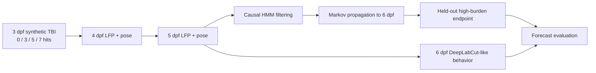

# Larval Zebrafish TBI Markov Modeling

[](https://github.com/josephreggy23-coder/Latent-Period-Epileptogenesis-Assessment-Via-Markov-Modeling/actions/workflows/ci.yml)


An installable, fully tested computational-neuroscience benchmark for modeling
early post-traumatic electrophysiological dynamics in larval zebrafish.

The repository simulates a syringe-blast traumatic brain injury (TBI) at
3 days post fertilization (dpf), records synthetic local field potential (LFP)
and pose-derived behavior at 4–6 dpf, and fits a hidden Markov model (HMM) with
both worsening and recovery transitions. The primary held-out task forecasts a
planted 6 dpf high-burden state using only the uninterrupted, QC-passing 4–5 dpf
LFP prefix.


## Benchmark at a glance

| Component | Seed-42 benchmark |
|---|---:|
| Synthetic larvae | 240, 60 per arm |
| Injury arms | sham and 3/5/7 repeated hits |
| LFP/behavior sessions | 706 at 4–6 dpf |
| QC-passing sessions | 683 (96.7%) |
| Contiguous model sessions | 662 from 231 fish |
| Selected statistical microstates | 4, mapped to 3 severity macrostates |
| Held-out DPF6 forecast cohort | 68 fish, 12 positives |
| ROC-AUC | 0.864 (95% bootstrap CI 0.758–0.945) |
| Average precision / Brier score | 0.489 / 0.104 |
| Held-out planted-state balanced accuracy | 1.000 |

Perfect planted-state recovery is a simulator check, not a biological result.
The forward endpoint forecast is the more meaningful benchmark.


## Experimental and analysis flow



## Repository layout

```text
.
├── .github/workflows/ci.yml       continuous integration
├── data/
│   ├── README.md                  data provenance and schema guide
│   └── synthetic/                 normalized CSVs, manifest, workbook
├── docs/
│   ├── METHODS.md                 experimental and statistical methods
│   └── REPRODUCIBILITY.md         deterministic workflow and safeguards
├── results/
│   ├── figures/                   publication-ready diagnostic figures
│   ├── tables/                    scored sessions and summary tables
│   ├── TBI_MODEL_RESULTS.md       human-readable benchmark report
│   └── tbi_model_metrics.json     machine-readable metrics
├── scripts/                       lightweight command-line wrappers
├── src/tbi_markov/                installable analysis package
├── tests/                         simulator, HMM, leakage, and smoke tests
├── CITATION.cff
├── CONTRIBUTING.md
├── pyproject.toml
└── README.md
```

## Installation

Python 3.10 or newer is required.

```bash
git clone https://github.com/josephreggy23-coder/Latent-Period-Epileptogenesis-Assessment-Via-Markov-Modeling.git
cd Latent-Period-Epileptogenesis-Assessment-Via-Markov-Modeling
python -m venv .venv

# Activate the environment:
# Windows: .venv\Scripts\activate
# macOS/Linux: source .venv/bin/activate

python -m pip install --upgrade pip
python -m pip install -e ".[dev]"
```

## Reproduce the benchmark

Run the complete deterministic workflow:

```bash
python -m tbi_markov
```

Equivalent installed commands are:

```bash
tbi-generate --seed 42 --n-per-arm 60
tbi-analyze
tbi-pipeline
```

The stages can also be invoked from `scripts/`:

```bash
python scripts/generate_dataset.py --seed 42 --n-per-arm 60
python scripts/run_analysis.py
python scripts/run_pipeline.py
```

The generator rewrites the normalized CSV tables and manifest under
`data/synthetic/`. The formatted Excel workbook is the committed human-readable
snapshot of the default seed-42 cohort; the CSV tables and manifest are
authoritative after a custom run.

## Methods summary

### Synthetic TBI design

The apparatus is held constant at a 10 mL syringe, three-prong clamp, 200 g
weight, and 108 cm height. Only the repeated-hit count varies:

| Arm | Hits | Nominal per-hit pressure |
|---|---:|---:|
| `sham` | 0 | 0 kPa |
| `tbi_low` | 3 | 195 kPa |
| `tbi_moderate` | 5 | 195 kPa |
| `tbi_high` | 7 | 195 kPa |

The 195 kPa center is a simulator assumption inside the approximately
90–300 kPa behavioral-seizure range reported by Locskai et al.; it is not an
experimental group mean. `cumulative_pressure_burden_kpa_hits` is a synthetic
kPa-hits dose index, not a measured pressure integral.

### LFP feature interface

The HMM receives only seven Eimon-inspired session summaries:

```text
lfp_mean_uv
lfp_variance_uv2
lfp_skewness
lfp_kurtosis
lfp_fourth_power_mean_uv4
lfp_seizure_event_rate_per_h
lfp_ica_complexity
```

Group, dose, pressure, batch, QC metadata, behavior, and every `*_TRUTH` field
are excluded from the feature matrix. Positive heavy-tailed features receive a
`log1p` transform; median/IQR scaling is fit on training fish only.

### Leakage and temporal safeguards

- The 70%/30% partition is made at the fish level.
- The split is stratified by arm and planted endpoint, but the endpoint never
  enters HMM fitting.
- A failed or missing session terminates the uninterrupted 4 dpf-based prefix;
  a 4-to-6 dpf gap is never compressed into one Markov step.
- Model selection uses training data only.
- Held-out state recovery is scored only after fitting.
- The DPF6 forecast filters the available 4–5 dpf prefix and propagates the
  resulting state distribution through the learned transition matrix.
- DeepLabCut-like behavior is an independent validation channel, never an HMM
  input.

See [Methods](docs/METHODS.md) for the complete protocol and
[Reproducibility](docs/REPRODUCIBILITY.md) for implementation safeguards.

## Tests

```bash
python -m pytest
```

The test suite covers deterministic generation, schema/QC rules, manifest
hashes, feature isolation, fish-level splitting, contiguous sequence handling,
HMM normalization and recovery, causal prefix invariance, Markov propagation,
and an end-to-end smoke run.

## Scientific boundaries

- The exact repeated 4–6 dpf same-fish LFP schedule is hypothetical.
- Eimon et al. studied 7 dpf `scn1lab` larvae, not TBI larvae.
- DeepLabCut-like values were generated without videos or a trained network.
- The hidden states and DPF6 endpoint are planted simulator constructs.
- A real study requires prospective validation of mortality, missingness,
  electrode placement, batch effects, pose estimation, and blinded behavioral
  scoring.

## Primary references

1. Locskai LF, Gill T, Tan SAW, et al. *A larval zebrafish model of traumatic
   brain injury: optimizing the dose of neurotrauma for discovery of treatments
   and aetiology.* Biology Open. 2025;14(2):bio060601.
   [doi:10.1242/bio.060601](https://doi.org/10.1242/bio.060601)
2. Eimon PM, Ghannad-Rezaie M, De Rienzo G, et al. *Brain activity patterns in
   high-throughput electrophysiology screen predict both drug efficacies and
   side effects.* Nature Communications. 2018;9:219.
   [doi:10.1038/s41467-017-02404-4](https://doi.org/10.1038/s41467-017-02404-4)
3. Mathis A, Mamidanna P, Cury KM, et al. *DeepLabCut: markerless pose
   estimation of user-defined body parts with deep learning.* Nature
   Neuroscience. 2018;21:1281–1289.
   [doi:10.1038/s41593-018-0209-y](https://doi.org/10.1038/s41593-018-0209-y)
4. Nath T, Mathis A, Chen AC, et al. *Using DeepLabCut for 3D markerless pose
   estimation across species and behaviors.* Nature Protocols.
   2019;14:2152–2176.
   [doi:10.1038/s41596-019-0176-0](https://doi.org/10.1038/s41596-019-0176-0)

## Citation

Use the repository metadata in [CITATION.cff](CITATION.cff). The source code,
dataset, and results should be cited as a synthetic computational benchmark,
not as experimental animal data.
