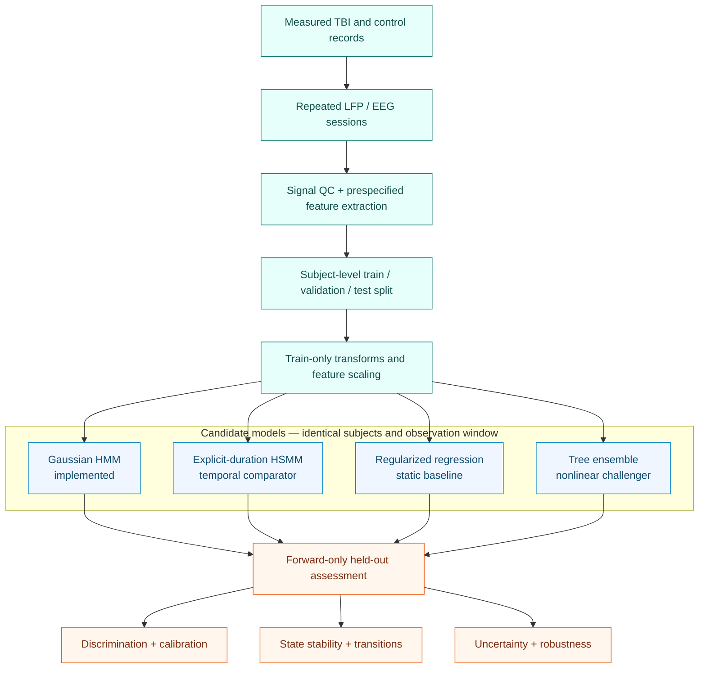

<p align="center">
  
</p>

<h1 align="center">Latent-Period Epileptogenesis Assessment</h1>

<p align="center">
  <strong>Interpretable longitudinal state modeling after traumatic brain injury</strong><br>
  Repeated LFP measurements → latent-state trajectories → forward-only risk assessment
</p>

<p align="center">
  <a href="https://github.com/josephreggy23-coder/Latent-Period-Epileptogenesis-Assessment-Via-Markov-Modeling/actions/workflows/ci.yml"></a>
  
  
  
  
</p>

<p align="center">
  <a href="#project-at-a-glance">Overview</a> •
  <a href="#current-model-landscape">Current models</a> •
  <a href="#analysis-architecture">Architecture</a> •
  <a href="#data">Data</a> •
  <a href="#outputs">Outputs</a> •
  <a href="#quick-start">Quick start</a>
</p>

> [!NOTE]
> This project addresses **epileptogenesis and later post-traumatic epilepsy
> risk**. It is not a minutes-before-onset seizure forecasting system. Those are
> different prediction targets, timescales, and validation problems.

## Project at a glance

| | |
|---|---|
| **Scientific question** | Do early post-TBI electrophysiological trajectories contain interpretable state transitions associated with a later prespecified endpoint? |
| **Study unit** | One animal or participant with repeated observations |
| **Primary input** | Longitudinal, QC-passing LFP/EEG feature vectors |
| **Primary model** | Diagonal-Gaussian hidden Markov model |
| **Closest comparator** | Explicit-duration hidden semi-Markov model |
| **Required baseline** | Regularized clinical/landmark regression |
| **Validation unit** | Entire subjects—not individual rows or windows |
| **Primary outputs** | State probabilities, transitions, trajectories, forecast risk, calibration, and uncertainty |

The model is meant to answer two connected questions:

1. **State assessment:** what electrophysiological regime is most plausible at
   each observation?
2. **Risk assessment:** using only information available before the endpoint,
   how much evidence is there for a later high-burden outcome?

## Current model landscape

Published epileptogenesis and post-traumatic epilepsy (PTE) models fall into
three broad groups: clinical risk scores, multimodal machine learning, and
longitudinal state models. Their reported metrics are not directly comparable
because the cohorts, species, endpoints, follow-up periods, and validation
designs differ.

### Human PTE risk models

| Approach | Representative evidence | Reported validation | What it contributes | Main limitation |
|---|---|---|---|---|
| **Cox nomogram** | [Wang et al., 2021](https://doi.org/10.1016/j.seizure.2021.03.023) | 1,301-patient development cohort plus 834 patients in two external cohorts; reported C-index 0.846 and 0.895 | Strong clinical baseline with external validation and time-to-event framing | Uses mostly static clinical and injury variables; does not model evolving electrophysiological states |
| **Artificial neural network** | [Wang et al., 2021](https://doi.org/10.2196/25090) | Same development/external cohorts; reported AUC 0.907, 0.867, and 0.859 | Captures nonlinear interactions among 21 clinical variables | Less interpretable; authors reported calibration still needed improvement |
| **Resting-state fMRI random forest** | [Garner et al., 2019](https://doi.org/10.23919/SPRINGSIM.2019.8732859) | 49 EpiBioS4Rx participants, 11 with seizure outcome; repeated internal splits; reported mean accuracy 0.691 | Tests distributed connectivity biomarkers rather than clinical variables alone | Small cohort and no external validation |
| **Longitudinal EEG + CT regression** | [de Oliveira et al., 2025](https://doi.org/10.3389/fneur.2025.1609733) | 73 prospectively enrolled participants followed for up to 24 months | Directly studies serial EEG evolution and imaging associations with PTE | Follow-up disruption and no independent external prediction cohort |
| **First-day EEG multifractal random forest** | [Riabukhina et al., 2026](https://doi.org/10.21203/rs.3.rs-8613721/v1) | 66 analyzable EpiBioS4Rx participants; reported internal AUC 0.98 | Uses acute multiscale EEG dynamics for early risk stratification | Preprint; balanced filtered cohort and no external validation yet |
| **Acute CT radiomics + clinical model** | [2026 pilot study](https://pubmed.ncbi.nlm.nih.gov/42120454/) | 82 participants; nested cross-validation; reported best AUC 0.842 | Combines routinely available CT texture with clinical variables | Pilot-scale and not externally validated |

### Models that stage the epileptogenic process

| Approach | Evidence | Strength | Gap relative to this repository |
|---|---|---|---|
| **HMM over evoked potentials** | [Meyer et al., 2016](https://doi.org/10.1109/ICMLA.2016.0033) used longitudinal hippocampal evoked potentials in a 24-rat acquired-epilepsy study | Interpretable probabilities for baseline, silent, latent, and chronic stages | Pilocarpine model rather than TBI; dense evoked-potential protocol |
| **Deep residual EEG staging** | [Lu et al., 2020](https://arxiv.org/abs/2006.09885) classified baseline, early, and late epileptogenesis in 7 stimulated and 3 control rats | Learns directly from short raw-EEG segments and can expose discriminative patterns | Very small animal cohort, high data demand, and less transparent transition dynamics |
| **HMM versus HSMM brain-state analysis** | [Amoiridou et al.](https://doi.org/10.1007/s11571-025-10382-3) compared Markov and explicit-duration state models in epilepsy | Shows why dwell-time assumptions can materially change inferred brain-state dynamics | fMRI connectivity rather than post-TBI longitudinal LFP prediction |

### Where this repository fits

This repository occupies a different niche from a static nomogram or black-box
classifier:

- it models the **trajectory** of electrophysiological state, not only a final
  label;
- it exposes transition probabilities, occupancy, worsening, and recovery;
- it can produce an early forecast without using the held-out subject's
  target-day signal;
- it prioritizes interpretability and leakage control;
- it should be compared against stronger static baselines—not evaluated in
  isolation.

No cross-study leaderboard is claimed. A fair comparison requires the same
subjects, endpoint, observation window, and split for every candidate model.

## Model set

| Model | Role | Status | Why it belongs |
|---|---|---:|---|
| **Gaussian HMM** | Primary longitudinal model | **Implemented** | Parsimonious, interpretable state and transition estimates |
| **Explicit-duration HSMM** | Like-for-like temporal comparator | Proposed | Tests whether non-geometric state duration improves fit and calibration |
| **Elastic-net Cox/logistic model** | Required clinical/landmark baseline | Proposed | Tests whether temporal states add value beyond early static features |
| **Random forest or gradient boosting** | Nonlinear tabular challenger | Optional | Represents the dominant clinical/radiomic ML family |
| **Deep sequence model** | Dense-signal challenger | Conditional | Appropriate only with enough raw EEG/LFP and subjects to control overfitting |

The HSMM is the closest conceptual alternative to the implemented HMM. It
retains discrete latent states but estimates an explicit duration distribution
for each state. It should only be preferred when grouped validation improves
and its duration estimates remain stable.

## Analysis architecture



For a held-out subject, the forecast uses only that subject's pre-endpoint
observations. Training-subject observations may be used to estimate emission
and transition parameters. Model selection, hyperparameter tuning, and
threshold choice stay inside training/validation data.

## Data

The normalized study interface lives in [`data/template/`](data/template/).

| File | Key | Purpose |
|---|---|---|
| [`tbi_4_6dpf_lfp_timeseries.csv`](data/template/tbi_4_6dpf_lfp_timeseries.csv) | `fish_id`, `dpf` | Acquisition metadata, QC, and longitudinal LFP features |
| [`tbi_4_6dpf_fish_outcomes.csv`](data/template/tbi_4_6dpf_fish_outcomes.csv) | `fish_id` | Injury metadata, follow-up, and endpoint |
| [`tbi_4_6dpf_dlc_behavior.csv`](data/template/tbi_4_6dpf_dlc_behavior.csv) | `fish_id`, `dpf` | Behavioral and pose-summary variables |
| [`tbi_4_6dpf_dataset_manifest.json`](data/template/tbi_4_6dpf_dataset_manifest.json) | — | Definitions, provenance, sources, and file hashes |
| [`TBI_4_6dpf_data_template.xlsx`](data/template/TBI_4_6dpf_data_template.xlsx) | — | Human-readable review workbook |

> [!IMPORTANT]
> Before presenting any numerical output as a study result, verify the source,
> units, endpoint definition, and row-level provenance. The current pipeline
> blocks rows marked `placeholder_pending_replacement`. If the included tables
> are verified measured records, update their status and manifest only after
> that provenance review.

<details>
<summary><strong>HMM feature allowlist and leakage exclusions</strong></summary>

The implemented HMM uses:

```text
lfp_mean_uv
lfp_variance_uv2
lfp_skewness
lfp_kurtosis
lfp_fourth_power_mean_uv4
lfp_seizure_event_rate_per_h
lfp_ica_complexity
```

Group, injury dose, batch, QC outcomes, behavior, endpoint values, and every
`*_TRUTH` field are excluded from model inputs. Positive heavy-tailed features
receive `log1p`; robust scaling is learned from training subjects only.

</details>

## Evaluation

| Domain | Minimum comparison |
|---|---|
| **Time-to-event risk** | C-index and time-dependent AUC when follow-up time is available |
| **Discrimination** | ROC-AUC and average precision |
| **Calibration** | Brier score, calibration intercept/slope, and reliability curve |
| **Operating point** | Sensitivity, specificity, PPV, and NPV at a prospectively selected threshold |
| **State quality** | Posterior entropy, occupancy stability, transition stability, and dwell-time plausibility |
| **Generalization** | Subject-level bootstrap plus leave-one-batch/site-out analysis |
| **Added value** | HMM/HSMM improvement over regularized static baseline |
| **Uncertainty** | Confidence intervals that include subject resampling and, where possible, refitting |

Model results should be reported with cohort flow, missingness, attrition,
endpoint prevalence, and the exact prediction horizon. A model that looks good
only after row-level splitting or target-day leakage is not valid.

## Outputs

<table>
  <tr>
    <td width="50%" valign="top">
      <strong>Model summary</strong><br>
      <a href="results/TBI_MODEL_RESULTS.md">Generated analysis report</a><br>
      <a href="results/tbi_model_metrics.json">Machine-readable metrics and provenance</a>
    </td>
    <td width="50%" valign="top">
      <strong>Held-out assessment</strong><br>
      <a href="results/tables/tbi_split_assignments.csv">Subject split audit</a><br>
      <a href="results/tables/tbi_early_predictions.csv">Per-subject forecast table</a>
    </td>
  </tr>
  <tr>
    <td width="50%" valign="top">
      <strong>State dynamics</strong><br>
      <a href="results/tables/tbi_scored_test_sessions.csv">Session-level state scores</a><br>
      <a href="results/tables/tbi_state_occupancy.csv">State occupancy</a><br>
      <a href="results/tables/tbi_transition_matrix.csv">Transition matrix</a>
    </td>
    <td width="50%" valign="top">
      <strong>Visual diagnostics</strong><br>
      <a href="results/figures/tbi_model_selection.png">Model order</a><br>
      <a href="results/figures/tbi_state_trajectories.png">State trajectories</a><br>
      <a href="results/figures/tbi_early_prediction_roc.png">Forecast ROC</a>
    </td>
  </tr>
</table>

Existing numerical files are retained for audit. Interpret them as study
findings only after the data-provenance condition above has been satisfied.

## Quick start

```bash
git clone https://github.com/josephreggy23-coder/Latent-Period-Epileptogenesis-Assessment-Via-Markov-Modeling.git
cd Latent-Period-Epileptogenesis-Assessment-Via-Markov-Modeling
python -m venv .venv
python -m pip install -e ".[dev]"
```

Activate the environment:

```powershell
# PowerShell
.\.venv\Scripts\Activate.ps1
```

```bash
# macOS / Linux
source .venv/bin/activate
```

Run verified records:

```bash
tbi-analyze \
  --data-dir data/my-study \
  --output-dir build/my-study-results
```

Verify the software:

```bash
python -m pytest
python -m compileall -q src scripts
```

The measured-data workflow does not require an opt-in placeholder flag. Raw LFP
feature extraction and pose estimation are upstream procedures and must be
validated before their summaries enter the normalized tables.

## Scientific scope

| Supported use | Not established by this repository alone |
|---|---|
| Probabilistic longitudinal state description | A definitive biological stage of epileptogenesis |
| Forward-only association with a later endpoint | Causal effects of injury or treatment |
| Subject-level comparison of candidate models | Clinical diagnostic or deployment readiness |
| Interpretable transition and occupancy summaries | Generalization across species, sites, or acquisition systems |
| Reproducible tables, metadata, and figures | Superiority over published models without head-to-head testing |

If only a few daily observations are available, the HMM and a static baseline
are more defensible than a heavily parameterized duration or deep sequence
model. HSMMs require enough temporal resolution to identify state durations;
deep models require substantially more independent subjects and raw signal.

<details>
<summary><strong>Method and repository details</strong></summary>

### Core safeguards

1. Enforce schema, units, domains, unique keys, and cross-table agreement.
2. Keep every observation from one subject in exactly one partition.
3. Fit transformations, scaling, and models on training subjects only.
4. Use uninterrupted QC-passing prefixes; a temporal gap ends the prefix.
5. Order latent states without consulting held-out endpoint labels.
6. Treat “causal filtering” as forward-only signal inference—not causal-effect
   estimation.

### Repository map

```text
.
|-- data/template/                normalized tables, manifest, workbook
|-- docs/                         methods and reproducibility guidance
|-- results/
|   |-- figures/                  visual diagnostics
|   `-- tables/                   auditable outputs
|-- scripts/                      command-line wrappers
|-- src/tbi_markov/               HMM and analysis pipeline
|-- tests/                        schema, temporal, HMM, pipeline tests
|-- CITATION.cff
|-- CONTRIBUTING.md
`-- README.md
```

</details>

<details>
<summary><strong>Evidence base</strong></summary>

1. Wang X, Zhong J, Lei T, et al. *Development and external validation of a
   predictive nomogram model of posttraumatic epilepsy.* Seizure. 2021;88:36–44.
   [doi:10.1016/j.seizure.2021.03.023](https://doi.org/10.1016/j.seizure.2021.03.023)
2. Wang X, Zhong J, Lei T, et al. *An Artificial Neural Network Prediction
   Model for Posttraumatic Epilepsy.* JMIR. 2021;23:e25090.
   [doi:10.2196/25090](https://doi.org/10.2196/25090)
3. Meyer FG, Benison AM, Smith Z, Barth DS. *Decoding Epileptogenesis in a
   Reduced State Space.* ICMLA. 2016:152–157.
   [doi:10.1109/ICMLA.2016.0033](https://doi.org/10.1109/ICMLA.2016.0033)
4. de Oliveira JPS, Sanabria V, Baise C, et al. *Two-year longitudinal and
   prospective electroencephalographic follow-up in patients with TBI.*
   Frontiers in Neurology. 2025;16:1609733.
   [doi:10.3389/fneur.2025.1609733](https://doi.org/10.3389/fneur.2025.1609733)
5. Vespa PM, Shrestha V, Abend N, et al. *The EpiBioS4Rx Clinical Biomarker
   Study Design and Protocol.* Neurobiology of Disease. 2019;123:110–114.
   [doi:10.1016/j.nbd.2018.07.025](https://doi.org/10.1016/j.nbd.2018.07.025)
6. Locskai LF, Gill T, Tan SAW, et al. *A larval zebrafish model of traumatic
   brain injury.* Biology Open. 2025;14(2):bio060601.
   [doi:10.1242/bio.060601](https://doi.org/10.1242/bio.060601)
7. Eimon PM, Ghannad-Rezaie M, De Rienzo G, et al. *Brain activity patterns in
   high-throughput electrophysiology screen predict both drug efficacies and
   side effects.* Nature Communications. 2018;9:219.
   [doi:10.1038/s41467-017-02404-4](https://doi.org/10.1038/s41467-017-02404-4)

</details>

## Citation and contributing

Use [`CITATION.cff`](CITATION.cff) and cite the exact commit used for analysis.
Contributions should preserve subject-level validation, forward-only inference,
explicit provenance, and the separation between statistical states and
biological interpretation. See [`CONTRIBUTING.md`](CONTRIBUTING.md).
