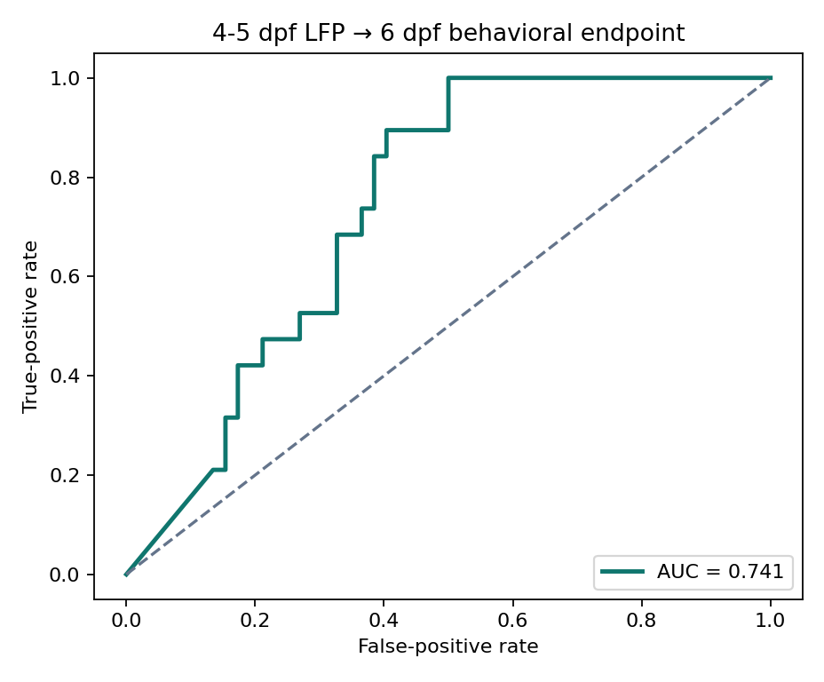
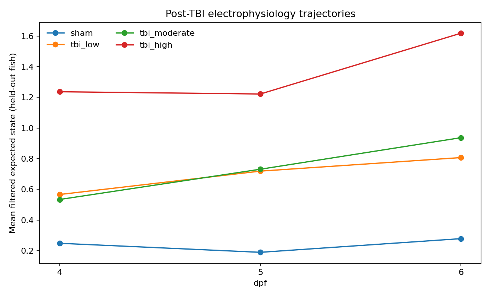
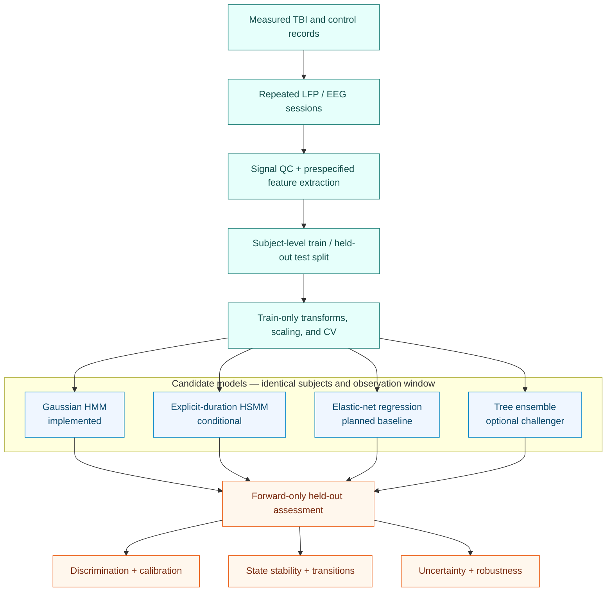

<h1 align="center">Latent-Period Epileptogenesis Assessment</h1>

<p align="center">
  <strong>Interpretable longitudinal state modeling after traumatic brain injury</strong><br>
  Measured larval-zebrafish LFP → latent-state trajectories → forward-only risk assessment
</p>

<p align="center">
  <a href="https://github.com/josephreggy23-coder/Latent-Period-Epileptogenesis-Assessment-Via-Markov-Modeling/actions/workflows/ci.yml"></a>
  
  
  
  
</p>

<p align="center">
  <a href="#project-at-a-glance">Overview</a> •
  <a href="#measured-data-results">Results</a> •
  <a href="#current-model-landscape">Current models</a> •
  <a href="#analysis-architecture">Architecture</a> •
  <a href="#documentation">Documentation</a> •
  <a href="#data">Data</a> •
  <a href="#outputs">Outputs</a> •
  <a href="#quick-start">Quick start</a>
</p>

> [!NOTE]
> This is an exploratory model of early post-TBI state trajectories and a 6 dpf
> behavioral event endpoint. A single event does not establish chronic epilepsy,
> and this is not a minutes-before-onset seizure forecasting system.

> [!IMPORTANT]
> The feature allowlist, model order range, primary and secondary outcomes,
> and split rule below were frozen in
> [`docs/PREREGISTRATION.md`](docs/PREREGISTRATION.md) at commit
> [`f684ee4`](../../commit/f684ee4edd82b86f68de4c4e8c3b44ce15d15224) **before**
> any refitting on the reduced feature set. Any later deviation requires a
> dated amendment in that document.

## Project at a glance

| | |
|---|---|
| **Scientific question** | Do early post-TBI electrophysiological trajectories contain interpretable state transitions associated with a later prespecified endpoint? |
| **Cohort** | 240 wild-type AB larval zebrafish; 60 per injury arm |
| **Injury design** | 3 dpf sham or one 100/200/300 g drop from 108 cm; measured peak pressure 0/115/210/319 kPa |
| **Observation window** | Single-electrode forebrain LFP and behavior at 4, 5, and 6 dpf |
| **Study unit** | One fish with repeated observations |
| **Primary input** | Longitudinal, QC-passing LFP/EEG feature vectors |
| **Primary model** | Diagonal-Gaussian hidden Markov model |
| **Planned baseline** | Elastic-net landmark logistic regression on the same early features |
| **Duration alternative** | Hidden semi-Markov model only if denser trajectories become available |
| **Validation unit** | Entire subjects—not individual rows or windows |
| **Primary outputs** | State probabilities, transitions, trajectories, forecast risk, calibration, and uncertainty |

The model is meant to answer two connected questions:

1. **State assessment:** what electrophysiological regime is most plausible at
   each observation?
2. **Risk assessment:** using only information available before the endpoint,
   how much evidence is there for a later high-burden outcome?

## Measured-data results

> [!IMPORTANT]
> These are results from a **retrospective, single-cohort measured recording**,
> not a clinically validated predictor. There is no latent-state ground truth,
> so state-recovery accuracy cannot be measured.

<table>
  <tr>
    <td width="25%"><strong>240 fish</strong><br>706 sessions at 4–6 dpf<br>100% passed QC</td>
    <td width="25%"><strong>K = 4</strong><br>lowest train-only BIC<br>among K = 2–4</td>
    <td width="25%"><strong>71 held-out fish</strong><br>19 endpoint-positive<br>4–5 dpf → 6 dpf</td>
    <td width="25%"><strong>ROC-AUC 0.749</strong><br>95% bootstrap CI<br>0.642–0.853</td>
  </tr>
</table>

The fish-level partition contains 168 training and 72 test fish with zero
overlap. Across the cohort, the behavioral endpoint is resolved for 233 fish
(60 positive, 173 negative) and unresolved for 7.

| Held-out measure | Result | Interpretation |
|---|---:|---|
| Average precision | **0.438** | Positive prevalence was 0.268 |
| Brier score | **0.206** | Forecast probabilities were poorly calibrated to the behavioral endpoint |
| Sensitivity / specificity at 0.50 | **0.105 / 0.962** | The fixed 0.50 threshold is not a useful operating point here |
| Injury-dose index vs forecast risk | **ρ = 0.623**, p = 6.38×10⁻⁹ | Pooled dose association; not evidence of a causal dose response |
| Forecast risk vs 6 dpf behavioral abnormality | **ρ = 0.320**, p = 0.00874, n = 66 | Modest cross-channel association |
| Dose/batch-adjusted behavioral association | **partial ρ = 0.033**, p = 0.793 | The unadjusted association does not survive this adjustment |

<table>
  <tr>
    <td width="50%" valign="top">
      <a href="results/figures/tbi_early_prediction_roc.png">
        
      </a>
      <br><sub><strong>Held-out forecast.</strong> The final 4–5 dpf filtered
      state distribution is propagated to 6 dpf without target-day LFP.</sub>
    </td>
    <td width="50%" valign="top">
      <a href="results/figures/tbi_state_trajectories.png">
        
      </a>
      <br><sub><strong>State trajectories.</strong> Severity-ordered statistical
      states summarize longitudinal LFP patterns; they are not proven biological stages.</sub>
    </td>
  </tr>
</table>

The HMM shows moderate ranking performance, but mean forecast risk was 0.116
against an observed positive rate of 0.268; only 4 of 71 held-out fish exceeded
0.50. Model order also reached the upper edge of the tested K = 2–4 range.
Accordingly, the four-state solution and the 0.50 threshold should both be
treated as analysis choices requiring independent validation, not biological or
deployment claims. See the [full generated report](results/TBI_MODEL_RESULTS.md)
for endpoint construction, calibration details, and experimental boundaries.

## Current model landscape

Published and preprint studies fall into three broad groups: static clinical
risk scores, multimodal machine learning, and models that stage a longitudinal
process. This evidence snapshot was reviewed in **July 2026**. Metrics should not
be ranked across rows because the populations, endpoints, prediction horizons,
and validation designs differ.

### Human post-traumatic seizure and PTE studies

| Study and model | Input | Exact endpoint | Cohort and validation | Reported performance | Main limitation |
|---|---|---|---|---|---|
| [Wang et al., 2021](https://doi.org/10.1016/j.seizure.2021.03.023), Cox nomogram | Static clinical and injury factors | Diagnosed PTE during follow-up | 1,301 development; two external cohorts, n = 421 and 413 | C-index 0.846 development; 0.895 combined external | Does not model evolving electrophysiology |
| [Wang et al., 2021](https://doi.org/10.2196/25090), artificial neural network | 21 clinical and radiologic variables | Diagnosed PTE during follow-up | Same source population: 1,301 development plus two external cohorts | AUC 0.907 development; 0.867 and 0.859 external | Same population as the nomogram; less interpretable and calibration needed improvement |
| [Garner et al., 2019](https://doi.org/10.23919/SPRINGSIM.2019.8732859), fMRI random forest | Resting-state functional connectivity | Self-reported ≥1 seizure within 6 months | n = 49, 11 positive; 100 stratified 70/30 splits | Mean accuracy 0.691 ± 0.036 | Small internal study; endpoint was not clinician-confirmed PTE |
| [de Oliveira et al., 2025](https://doi.org/10.3389/fneur.2025.1609733), EEG/CT regression | Serial EEG and acute CT | Late seizure/PTE observation | 73 analyzed: 9 event-positive, 57 event-negative, 7 deaths; 217 EEGs; 26 with ≥24-month EEG follow-up | Association analysis; no forecast AUC or calibration | Substantial attrition and no independently validated prediction model |
| [Riabukhina et al., 2026](https://doi.org/10.21203/rs.3.rs-8613721/v1), multifractal random forest | First-day scalp EEG | Late post-traumatic seizure | n = 66 after quality/missing-data exclusions, balanced 33/33; five-fold internal CV | AUC 0.98; accuracy 0.95 | Preprint, filtered balanced cohort, and no external validation |
| [Chao et al., 2026](https://doi.org/10.1038/s41598-026-47942-4), CT radiomics + clinical logistic model | Acute CT radiomics and clinical variables | One late post-traumatic seizure within 6 months | n = 82; nested cross-validation | Combined AUC 0.842 (95% CI 0.807–0.876) | Pilot study; one late seizure is not definitive recurrent PTE |

### Models that stage the epileptogenic process

| Study and model | Population and task | Reported evaluation | Relevance | Main limitation |
|---|---|---|---|---|
| [Meyer et al., 2016](https://doi.org/10.1109/ICMLA.2016.0033), HMM over evoked potentials | 17 lithium-pilocarpine rats plus 7 controls; decode baseline, silent, latent, and chronic periods | Longitudinal stage decoding | Interpretable state probabilities and transitions | Condition-informed periods derived from known chronology; non-TBI model |
| [Lu et al., 2020](https://doi.org/10.1145/3388440.3412480), deep residual EEG staging | 7 stimulated rats for leave-one-rat-out staging; 3 controls used separately | One-hour aggregate AUC 0.93/0.89/0.86 across three stages | Learns directly from short raw-EEG segments | All treated rats developed epilepsy; stages time-to-first-seizure rather than who develops epilepsy |
| [Amoiridou et al., 2026](https://doi.org/10.1007/s11571-025-10382-3), HMM and HSMM | Resting-state fMRI in established epilepsy versus controls | Comparison of HMM, Gamma-HSMM, and Poisson-HSMM group sensitivity | Demonstrates the effect of explicit dwell-time assumptions | Cross-sectional established epilepsy; no TBI, longitudinal epileptogenesis, or outcome forecast |

### Where this repository fits

This repository occupies a different niche from a static nomogram or black-box
classifier:

- it models the **trajectory** of electrophysiological state, not only a final
  label;
- it exposes transition probabilities, occupancy, worsening, and recovery;
- it can produce an early forecast without using the held-out subject's
  target-day signal;
- it prioritizes interpretability and leakage control;
- it should be compared against stronger static baselines—not evaluated in
  isolation.

No cross-study leaderboard is claimed. A fair comparison requires the same
subjects, endpoint, observation window, and split for every candidate model.
For this short three-session dataset, the cleanest future head-to-head baseline
is **elastic-net landmark logistic regression** on the same early features and
the exact same fish-level split. An HSMM is a secondary duration-model
sensitivity analysis, not a simpler baseline.

## Model set

| Model | Role | Status | Why it belongs |
|---|---|---:|---|
| **Gaussian HMM** | Primary longitudinal model | **Implemented** | Parsimonious, interpretable state and transition estimates |
| **Elastic-net landmark logistic model** | Primary head-to-head baseline | Proposed | Tests whether temporal states add value beyond early static features |
| **Explicit-duration HSMM** | Duration-model sensitivity analysis | Conditional | Tests non-geometric state duration only if denser trajectories become available |
| **Random forest or gradient boosting** | Nonlinear tabular challenger | Optional | Represents the dominant clinical/radiomic ML family |
| **Deep sequence model** | Dense-signal challenger | Conditional | Appropriate only with enough raw EEG/LFP and subjects to control overfitting |

The elastic-net baseline is simpler, uses the same endpoint and split, and
directly tests whether state dynamics add predictive value. An HSMM retains
discrete latent states but estimates an explicit duration distribution; with
only three daily observations per fish, those duration estimates are unlikely
to be identifiable.

## Analysis architecture



For a held-out subject, the forecast uses only that subject's pre-endpoint
observations. Training-subject observations may be used to estimate emission
and transition parameters. Model selection, hyperparameter tuning, and
preprocessing stay within training subjects and train-only cross-validation;
the 0.50 threshold is prespecified and never tuned on the held-out set.

## Documentation

<table>
  <tr>
    <td width="25%" valign="top">
      <strong><a href="docs/EXPERIMENTAL_PROTOCOL.md">Experimental protocol</a></strong><br>
      Apparatus, pressure calibration, longitudinal recording design, and wet-lab limitations
    </td>
    <td width="25%" valign="top">
      <strong><a href="docs/METHODS.md">Analysis methods</a></strong><br>
      Endpoint construction, preprocessing, HMM fitting, validation, and statistics
    </td>
    <td width="25%" valign="top">
      <strong><a href="docs/REPRODUCIBILITY.md">Reproducibility</a></strong><br>
      Determinism, leakage controls, environment setup, and audit checks
    </td>
    <td width="25%" valign="top">
      <strong><a href="data/README.md">Data guide</a></strong><br>
      Source-workbook contract, normalized schemas, and endpoint semantics
    </td>
  </tr>
</table>

## Data

The analysis begins with two versioned source workbooks:

| Source | Sheet(s) | Unit |
|---|---|---|
| [`actualdata1(lfp).xlsx`](actualdata1%28lfp%29.xlsx) | `LFP Recordings` | One row per fish-session |
| [`actualdata(behavioral).xlsx`](actualdata%28behavioral%29.xlsx) | `Behavioral Outcomes`, `Event Log` | Fish-level outcomes and scored behavioral events |

[`tbi_markov.dataset`](src/tbi_markov/dataset.py) validates and normalizes those
workbooks into [`data/measured/`](data/measured/):

| Normalized file | Key | Purpose |
|---|---|---|
| [`tbi_4_6dpf_lfp_timeseries.csv`](data/measured/tbi_4_6dpf_lfp_timeseries.csv) | `fish_id`, `dpf` | Acquisition metadata, QC, and seven longitudinal LFP features |
| [`tbi_4_6dpf_fish_outcomes.csv`](data/measured/tbi_4_6dpf_fish_outcomes.csv) | `fish_id` | Injury metadata, follow-up, and three-valued endpoint |
| [`tbi_4_6dpf_behavior.csv`](data/measured/tbi_4_6dpf_behavior.csv) | `fish_id`, `dpf` | Session-level manual behavior and pose-derived summaries |
| [`tbi_4_6dpf_manifest.json`](data/measured/tbi_4_6dpf_manifest.json) | — | Cohort counts, endpoint definition, groups, and feature list |

> [!IMPORTANT]
> The repository contains **measured records**. The workbooks are the analysis
> inputs and the CSV files are reproducible derivatives. Seven fish with no
> observed 6 dpf session retain an unresolved endpoint (`NA`) rather than being
> relabeled as negatives.

<details>
<summary><strong>HMM feature allowlist and leakage exclusions</strong></summary>

The implemented HMM uses:

```text
lfp_mean_uv
lfp_variance_uv2
lfp_skewness
lfp_kurtosis
lfp_fourth_power_mean_uv4
lfp_seizure_event_rate_per_h
lfp_ica_complexity
```

Group, injury dose, batch, QC outcomes, behavior, endpoint values, and every
`*_TRUTH` field are excluded from model inputs. Positive heavy-tailed features
receive `log1p`; robust scaling is learned from training subjects only.

</details>

## Evaluation

The current release reports the held-out HMM assessment above. A future
same-cohort model comparison should use the following evaluation standard:

| Domain | Minimum comparison |
|---|---|
| **Time-to-event risk** | C-index and time-dependent AUC when follow-up time is available |
| **Discrimination** | ROC-AUC and average precision |
| **Calibration** | Brier score, calibration intercept/slope, and reliability curve |
| **Operating point** | Sensitivity, specificity, PPV, and NPV at a prospectively selected threshold |
| **State quality** | Posterior entropy, occupancy stability, transition stability, and dwell-time plausibility |
| **Generalization** | Subject-level bootstrap plus leave-one-batch/site-out analysis |
| **Added value** | HMM improvement over a regularized static baseline; HSMM only with adequate temporal density |
| **Uncertainty** | Confidence intervals that include subject resampling and, where possible, refitting |

Model results should be reported with cohort flow, missingness, attrition,
endpoint prevalence, and the exact prediction horizon. A model that looks good
only after row-level splitting or target-day leakage is not valid.

## Outputs

<table>
  <tr>
    <td width="50%" valign="top">
      <strong>Model summary</strong><br>
      <a href="results/TBI_MODEL_RESULTS.md">Generated analysis report</a><br>
      <a href="results/tbi_model_metrics.json">Machine-readable metrics and provenance</a>
    </td>
    <td width="50%" valign="top">
      <strong>Held-out assessment</strong><br>
      <a href="results/tables/tbi_split_assignments.csv">Subject split audit</a><br>
      <a href="results/tables/tbi_early_predictions.csv">Per-subject forecast table</a>
    </td>
  </tr>
  <tr>
    <td width="50%" valign="top">
      <strong>State dynamics</strong><br>
      <a href="results/tables/tbi_scored_test_sessions.csv">Session-level state scores</a><br>
      <a href="results/tables/tbi_state_occupancy.csv">State occupancy</a><br>
      <a href="results/tables/tbi_transition_matrix.csv">Transition matrix</a>
    </td>
    <td width="50%" valign="top">
      <strong>Visual diagnostics</strong><br>
      <a href="results/figures/tbi_model_selection.png">Model order</a><br>
      <a href="results/figures/tbi_state_trajectories.png">State trajectories</a><br>
      <a href="results/figures/tbi_early_prediction_roc.png">Forecast ROC</a>
    </td>
  </tr>
</table>

The committed outputs are generated from the measured workbooks. Interpret them
within the retrospective cohort and experimental constraints documented in the
[results report](results/TBI_MODEL_RESULTS.md) and
[wet-lab protocol](docs/EXPERIMENTAL_PROTOCOL.md).

## Quick start

```bash
git clone https://github.com/josephreggy23-coder/Latent-Period-Epileptogenesis-Assessment-Via-Markov-Modeling.git
cd Latent-Period-Epileptogenesis-Assessment-Via-Markov-Modeling
python -m venv .venv
python -m pip install -e ".[dev]"
```

Activate the environment:

```powershell
# PowerShell
.\.venv\Scripts\Activate.ps1
```

```bash
# macOS / Linux
source .venv/bin/activate
```

Rebuild the normalized measured tables and all analysis outputs:

```bash
python -m tbi_markov
```

Equivalent entry points are `tbi-analyze` and
`python scripts/run_analysis.py`. To analyze compatible replacement workbooks:

```bash
tbi-analyze \
  --lfp-workbook path/to/lfp.xlsx \
  --behavior-workbook path/to/behavior.xlsx \
  --output-dir path/to/results
```

Verify the software:

```bash
python -m pytest
python -m compileall -q src scripts
```

The default command reads the two root-level workbooks, rewrites
`data/measured/`, and writes the report, metrics, tables, and figures under
`results/`. Raw LFP feature extraction and pose estimation are upstream
procedures and must be validated before their summaries enter these workbooks.

## Scientific scope

| Supported use | Not established by this repository alone |
|---|---|
| Probabilistic longitudinal state description | A definitive biological stage of epileptogenesis |
| Forward-only association with a later endpoint | Causal effects of injury or treatment |
| Subject-level comparison of candidate models | Clinical diagnostic or deployment readiness |
| Interpretable transition and occupancy summaries | Generalization across species, sites, or acquisition systems |
| Reproducible tables, metadata, and figures | Superiority over published models without head-to-head testing |

If only a few daily observations are available, the HMM and a static baseline
are more defensible than a heavily parameterized duration or deep sequence
model. HSMMs require enough temporal resolution to identify state durations;
deep models require substantially more independent subjects and raw signal.

Key study boundaries:

- the dataset provides at most three sessions and two observed transitions per
  fish;
- the combined 3 dpf TBI followed by 4–6 dpf LFP-plus-behavior protocol is an
  unpiloted integration of published methods;
- repeated penetrating forebrain recording in the same larva has not been
  validated;
- injury/drop batch—the protocol's experimental unit—is not identified in the
  records;
- pressures above approximately 300 kPa may suppress locomotion, making low
  movement ambiguous in the highest-dose arm.

<details>
<summary><strong>Method and repository details</strong></summary>

### Core safeguards

1. Enforce schema, units, domains, unique keys, and cross-table agreement.
2. Keep every observation from one subject in exactly one partition.
3. Fit transformations, scaling, and models on training subjects only.
4. Use uninterrupted QC-passing prefixes; a temporal gap ends the prefix.
5. Order latent states without consulting held-out endpoint labels.
6. Treat “causal filtering” as forward-only signal inference—not causal-effect
   estimation.

### Repository map

```text
.
|-- actualdata1(lfp).xlsx         source LFP workbook
|-- actualdata(behavioral).xlsx   source outcome and event workbook
|-- data/measured/                normalized measured tables and manifest
|-- docs/                         protocol and reproducibility guidance
|-- results/
|   |-- figures/                  visual diagnostics
|   `-- tables/                   auditable outputs
|-- scripts/                      command-line wrappers
|-- src/tbi_markov/               ingestion, HMM, and analysis pipeline
|-- tests/                        schema, temporal, HMM, pipeline tests
|-- CITATION.cff
|-- CONTRIBUTING.md
`-- README.md
```

</details>

<details>
<summary><strong>Evidence base</strong></summary>

1. Wang X, Zhong J, Lei T, et al. *Development and external validation of a
   predictive nomogram model of posttraumatic epilepsy.* Seizure. 2021;88:36–44.
   [doi:10.1016/j.seizure.2021.03.023](https://doi.org/10.1016/j.seizure.2021.03.023)
2. Wang X, Zhong J, Lei T, et al. *An Artificial Neural Network Prediction
   Model for Posttraumatic Epilepsy.* JMIR. 2021;23:e25090.
   [doi:10.2196/25090](https://doi.org/10.2196/25090)
3. Meyer FG, Benison AM, Smith Z, Barth DS. *Decoding Epileptogenesis in a
   Reduced State Space.* ICMLA. 2016:152–157.
   [doi:10.1109/ICMLA.2016.0033](https://doi.org/10.1109/ICMLA.2016.0033)
4. de Oliveira JPS, Sanabria V, Baise C, et al. *Two-year longitudinal and
   prospective electroencephalographic follow-up in patients with TBI.*
   Frontiers in Neurology. 2025;16:1609733.
   [doi:10.3389/fneur.2025.1609733](https://doi.org/10.3389/fneur.2025.1609733)
5. Vespa PM, Shrestha V, Abend N, et al. *The EpiBioS4Rx Clinical Biomarker
   Study Design and Protocol.* Neurobiology of Disease. 2019;123:110–114.
   [doi:10.1016/j.nbd.2018.07.025](https://doi.org/10.1016/j.nbd.2018.07.025)
6. Locskai LF, Gill T, Tan SAW, et al. *A larval zebrafish model of traumatic
   brain injury.* Biology Open. 2025;14(2):bio060601.
   [doi:10.1242/bio.060601](https://doi.org/10.1242/bio.060601)
7. Eimon PM, Ghannad-Rezaie M, De Rienzo G, et al. *Brain activity patterns in
   high-throughput electrophysiology screen predict both drug efficacies and
   side effects.* Nature Communications. 2018;9:219.
   [doi:10.1038/s41467-017-02404-4](https://doi.org/10.1038/s41467-017-02404-4)

</details>

## Citation and contributing

Use [`CITATION.cff`](CITATION.cff) and cite the exact commit used for analysis.
Contributions should preserve subject-level validation, forward-only inference,
explicit provenance, and the separation between statistical states and
biological interpretation. See [`CONTRIBUTING.md`](CONTRIBUTING.md).
