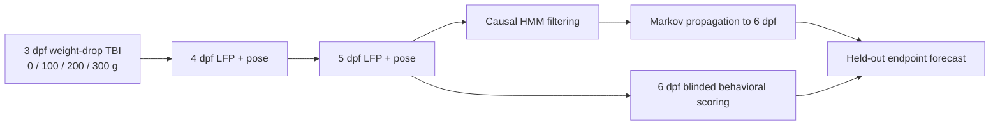

# Larval Zebrafish TBI Markov Modeling

[](https://github.com/josephreggy23-coder/Latent-Period-Epileptogenesis-Assessment-Via-Markov-Modeling/actions/workflows/ci.yml)


Hidden Markov modeling of local field potential (LFP) dynamics in larval
zebrafish after traumatic brain injury.

240 larvae receive a calibrated weight-drop TBI at 3 days post fertilization
(dpf). Single-electrode forebrain LFP and pose-derived behavior are recorded at
4, 5, and 6 dpf. The model infers latent severity states from LFP alone, then
runs one held-out task: **forecast the 6 dpf behavioral endpoint using only the
uninterrupted, QC-passing 4–5 dpf LFP prefix.**

## Results

| Component | Value |
|---|---:|
| Larvae | 240, 60 per arm |
| Injury arms | sham, 100 g, 200 g, 300 g (single drop) |
| Measured peak pressure | 0 / 115 / 210 / 319 kPa |
| LFP sessions at 4–6 dpf | 706 |
| QC-passing sessions | 706 (100%) |
| Contiguous model sessions | 706 from 240 fish |
| Endpoint resolved / unobserved | 233 fish / 7 fish (`NA`) |
| Selected statistical microstates | 4, mapped to 3 severity macrostates |
| Held-out forecast cohort | 71 fish, 19 positives |
| ROC-AUC | **0.749** (95% bootstrap CI 0.642–0.853) |
| Average precision / Brier score | 0.438 / 0.206 |
| Risk vs injury dose | Spearman ρ = 0.623 (p = 6×10⁻⁹) |


Full report: [`results/TBI_MODEL_RESULTS.md`](results/TBI_MODEL_RESULTS.md).

### Discrimination, not calibration

The forecast **ranks** fish well but is **poorly calibrated** against this
endpoint. Median forecast risk is 0.037 and only 4 of 71 held-out fish exceed
the fixed 0.5 threshold, so sensitivity there is 0.105 against a specificity of
0.962.

The propagated quantity is the probability of occupying the top *LFP*
macrostate, while the endpoint is a *behavioral* event — different scales, so
the risk sits below 0.5 for most animals. Any deployment would need a threshold
fitted on training fish; none is tuned on the held-out set. The metrics record
the observed positive rate next to the mean, median, and maximum forecast risk,
so this is checkable rather than asserted.

### There is no latent-state ground truth

These are real animals. Nothing establishes what latent state a fish "actually"
occupied, so state-recovery accuracy is **not measurable** — the analysis
reports no such number and substitutes no proxy. The latent states are validated
only indirectly: through the forward 6 dpf forecast, the dose ordering, and the
association with the independent behavioral channel.

## Experimental and analysis flow



## Repository layout

```text
.
├── .github/workflows/ci.yml       continuous integration
├── data/
│   ├── README.md                  data provenance and schema guide
│   └── measured/                  normalized CSVs and manifest
├── docs/
│   ├── EXPERIMENTAL_PROTOCOL.md   wet-lab protocol, apparatus, calibration
│   ├── METHODS.md                 analysis methods
│   └── REPRODUCIBILITY.md         deterministic workflow and safeguards
├── results/
│   ├── figures/                   diagnostic figures
│   ├── tables/                    scored sessions and summary tables
│   ├── TBI_MODEL_RESULTS.md       human-readable report
│   └── tbi_model_metrics.json     machine-readable metrics
├── scripts/                       command-line wrapper
├── src/tbi_markov/                installable analysis package
├── tests/                         schema, HMM, leakage, and smoke tests
├── CITATION.cff
├── CONTRIBUTING.md
├── pyproject.toml
└── README.md
```

## Installation

Python 3.10 or newer is required.

```bash
git clone https://github.com/josephreggy23-coder/Latent-Period-Epileptogenesis-Assessment-Via-Markov-Modeling.git
cd Latent-Period-Epileptogenesis-Assessment-Via-Markov-Modeling
python -m venv .venv

# Activate the environment:
# Windows: .venv\Scripts\activate
# macOS/Linux: source .venv/bin/activate

python -m pip install --upgrade pip
python -m pip install -e ".[dev]"
```

## Reproduce the analysis

```bash
python -m tbi_markov
```

Equivalent invocations:

```bash
tbi-analyze
python scripts/run_analysis.py
```

This normalizes the source workbooks into `data/measured/`, fits the HMM, and
writes metrics, tables, and figures to `results/`.

Source workbooks (expected at the repository root):

| File | Sheet | Contents |
|---|---|---|
| `actualdata1(lfp).xlsx` | `LFP Recordings` | one row per fish-session |
| `actualdata(behavioral).xlsx` | `Behavioral Outcomes` | one row per fish |
| `actualdata(behavioral).xlsx` | `Event Log` | one row per scored behavioral event |

## Experimental protocol

The wet-lab methodology is specified in full in
**[docs/EXPERIMENTAL_PROTOCOL.md](docs/EXPERIMENTAL_PROTOCOL.md)** — apparatus,
pressure calibration, plate layout, imaging, pose estimation, LFP acquisition,
and required metadata.

> **This is a new integrated protocol, not a replication.** No published study
> has run this exact combined experiment. Locskai et al. recorded acute behavior
> after TBI at 6 dpf and used a 3 dpf injury for a 7 dpf tau endpoint; Eimon et
> al. demonstrated penetrating forebrain LFP at 7 dpf; the high-speed pose study
> examined PTZ and genetic seizures at 3, 5, and 7 dpf. **3 dpf TBI followed by
> longitudinal 4–6 dpf LFP and behavior integrates three published methods and
> requires a pilot study.**

### Apparatus

| Parameter | Value |
|---|---|
| Fish | Wild-type AB larvae, 28 °C, 14 h/10 h light cycle, E3 |
| Injury | 3 dpf, **single** drop from 108 cm |
| Syringe / holder | 20 mL BD Luer-Lok in a three-prong clamp, 1.0 mL E3 |
| Arms | Sham (0 g), 100 g, 200 g, 300 g |
| Measured peak pressure | 0 / 115 / 210 / 319 kPa |
| Recording | 24, 48, 72 h post-insult (4, 5, 6 dpf) |
| Replicates | 6 clutches, 3 recording batches |

Locskai reported behavioral seizure phenotypes at roughly 90–300 kPa, with
pressures above ≈ 300 kPa suppressing gross locomotion — so **low movement in
the 300 g arm cannot be read as absence of seizures.**

## Methods

### LFP feature interface

The HMM receives only seven Eimon-inspired session summaries:

```text
lfp_mean_uv
lfp_variance_uv2
lfp_skewness
lfp_kurtosis
lfp_fourth_power_mean_uv4
lfp_seizure_event_rate_per_h
lfp_ica_complexity
```

Group, dose, pressure, batch, QC metadata, behavior, and the endpoint are
excluded from the feature matrix. Positive heavy-tailed features receive a
`log1p` transform; median/IQR scaling is fit on training fish only.

### The endpoint

The 6 dpf endpoint is **behavioral and three-valued**:

| Value | Meaning |
|---|---|
| `1` | ≥ 1 qualifying blinded event (Baraban stage ≥ 2, passing pose QC) at 6 dpf |
| `0` | observed at 6 dpf, no qualifying event |
| `NA` | no evidence the fish was observed at 6 dpf |

The `NA` class matters. An unobserved animal has an unknown outcome, not a
negative one; coding absence as `0` would pad the negative class with animals
nobody checked and inflate apparent discrimination. Seven fish fall in this
class and are excluded from endpoint scoring.

Evidence of observation is a 6 dpf LFP session **or** any 6 dpf behavioral row —
including a normal one, since the Event Log records normal swim bouts, so
presence proves observation while absence alone proves nothing.

The endpoint shares no variable with the LFP feature matrix, so the forecast
target is independent of the model's inputs.

### Behavioral aggregation

The Event Log is per-event; sessions with no scored event do not appear in it.
Those sessions are materialized with zero event rates rather than dropped —
"no scored behavior" is an observation, and omitting them would restrict the
behavioral validation to the abnormal subset and bias it.

The abnormality index uses only event-rate and stage terms, which stay defined
at zero events. Kinematic columns are reported but excluded from the index,
because they are undefined without an event and imputing them would manufacture
signal.

### Leakage and temporal safeguards

- The 70%/30% partition is made at the fish level.
- The split is stratified by arm and endpoint, but the endpoint never enters
  HMM fitting.
- A failed or missing session terminates the uninterrupted 4 dpf-based prefix;
  a 4-to-6 dpf gap is never compressed into one Markov step.
- Model selection uses training data only.
- The forecast filters the available 4–5 dpf prefix and propagates the resulting
  state distribution through the learned transition matrix.
- Pose-derived behavior is an independent validation channel, never an HMM
  input.

See [Methods](docs/METHODS.md) and [Reproducibility](docs/REPRODUCIBILITY.md).

## Tests

```bash
python -m pytest
```

The suite covers schema and QC rules, feature isolation, fish-level splitting,
contiguous sequence handling, HMM normalization and recovery, causal prefix
invariance, Markov propagation, an end-to-end smoke run, and the ingestion
contract — including that unobserved fish receive `NA` rather than `0`. Tests
needing the source workbooks skip automatically when they are absent.

## Scientific boundaries

- **Repeated penetrating forebrain LFP in the same larva at 4–6 dpf is not a
  validated preparation.** The electrode metadata (`forebrain` target, 1 M
  chloride, 2.45–3.57 MΩ) matches Eimon's penetrating preparation and its ≈ 3 MΩ
  stop criterion — yet 228 fish have all three daily sessions. That method was
  demonstrated at 7 dpf and never validated as recoverable across days. Under
  the protocol, that combination calls for independent terminal cohorts, in
  which individual longitudinal state transitions should not be claimed — and a
  Markov model over per-fish daily transitions presupposes the opposite. **This
  is the single most important thing a pilot must settle**, and no amount of
  modeling can resolve it.
- The combined 3 dpf TBI → 4–6 dpf LFP + behavior protocol is a new integration
  of three published methods and has not itself been published or piloted.
- Three sessions per fish is a short series for a Markov model: the transition
  matrix rests on at most two observed steps per animal.
- **`insult_batch_id` is absent.** The protocol makes the independent
  syringe/drop batch the experimental unit with larvae nested inside it, so
  drop batch cannot enter the model as a grouping variable; only clutch and
  recording batch can.
- Behavior is scored in three discrete sessions, so event timing is
  interval-censored; any reconstructed latency is a *first observed* time.
- Pressures above ≈ 300 kPa can suppress locomotion, so reduced movement in the
  highest-dose arm is ambiguous between "no seizure" and "too injured to move".
- A single qualifying event is not chronic epilepsy: this is an operational
  early post-traumatic seizure outcome, not post-traumatic epilepsy.
- One forebrain electrode per fish bounds the available information.
- This is a single cohort analyzed retrospectively, not a prospective or
  clinical claim.

## Primary references

1. Locskai LF, Gill T, Tan SAW, et al. *A larval zebrafish model of traumatic
   brain injury: optimizing the dose of neurotrauma for discovery of treatments
   and aetiology.* Biology Open. 2025;14(2):bio060601.
   [doi:10.1242/bio.060601](https://doi.org/10.1242/bio.060601)
2. Eimon PM, Ghannad-Rezaie M, De Rienzo G, et al. *Brain activity patterns in
   high-throughput electrophysiology screen predict both drug efficacies and
   side effects.* Nature Communications. 2018;9:219.
   [doi:10.1038/s41467-017-02404-4](https://doi.org/10.1038/s41467-017-02404-4)
3. Mathis A, Mamidanna P, Cury KM, et al. *DeepLabCut: markerless pose
   estimation of user-defined body parts with deep learning.* Nature
   Neuroscience. 2018;21:1281–1289.
   [doi:10.1038/s41593-018-0209-y](https://doi.org/10.1038/s41593-018-0209-y)
4. Nath T, Mathis A, Chen AC, et al. *Using DeepLabCut for 3D markerless pose
   estimation across species and behaviors.* Nature Protocols.
   2019;14:2152–2176.
   [doi:10.1038/s41596-019-0176-0](https://doi.org/10.1038/s41596-019-0176-0)
5. Whyte-Fagundes P, et al. *High-speed pose estimation of larval zebrafish
   seizure behavior.* Communications Biology. 2025.
   [doi:10.1038/s42003-025-08310-6](https://doi.org/10.1038/s42003-025-08310-6)
6. Hong S, et al. *iZAP: non-invasive zebrafish electrophysiology.* Scientific
   Reports. 2016;6:28248.
   [doi:10.1038/srep28248](https://doi.org/10.1038/srep28248)
7. Baraban SC, Taylor MR, Castro PA, Baier H. *Pentylenetetrazole induced
   changes in zebrafish behavior, neural activity and c-fos expression.*
   Neuroscience. 2005;131(3):759–768.
   [doi:10.1016/j.neuroscience.2004.11.031](https://doi.org/10.1016/j.neuroscience.2004.11.031)

## Citation

Use the repository metadata in [CITATION.cff](CITATION.cff). Cite this work as a
**retrospective single-cohort analysis** of a measured recording, not as a
prospective or clinical finding.
