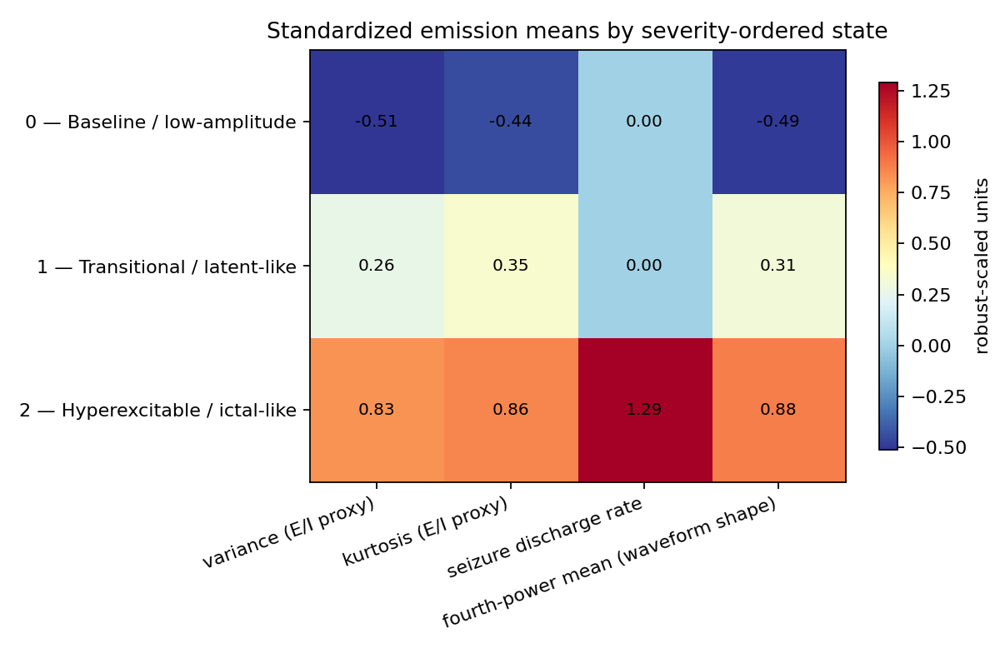

<h1 align="center">Latent-Period Epileptogenesis Assessment</h1>

<p align="center">
  <strong>Graded mechanical TBI produces dose-ordered latent LFP states in larval zebrafish</strong><br>
  A hidden Markov model that never sees injury dose recovers that ordering.
</p>

<p align="center">
  <a href="https://github.com/josephreggy23-coder/Latent-Period-Epileptogenesis-Assessment-Via-Markov-Modeling/actions/workflows/ci.yml"></a>
  
  
  
  
</p>

<p align="center">
  <a href="#claim">Claim</a> •
  <a href="#background">Background</a> •
  <a href="#methods">Methods</a> •
  <a href="#primary-result-dose-ordering">Primary result</a> •
  <a href="#state-interpretation">State interpretation</a> •
  <a href="#secondary-analysis-6-dpf-forecast">Secondary analysis</a> •
  <a href="#limitations">Limitations</a> •
  <a href="#reproduction">Reproduction</a>
</p>

> [!IMPORTANT]
> The feature allowlist, model order range, primary and secondary outcomes,
> and split rule below were frozen in
> [`docs/PREREGISTRATION.md`](docs/PREREGISTRATION.md) at commit
> [`f684ee4`](../../commit/f684ee4edd82b86f68de4c4e8c3b44ce15d15224) **before**
> any refitting on the reduced feature set. Any later deviation requires a
> dated amendment in that document.

## Claim

Graded mechanical brain injury produces dose-ordered latent electrophysiological
states in larval zebrafish. A hidden Markov model fit only on LFP features —
never on injury dose — recovers that ordering, and the recovered states are
interpretable as excitation-inhibition shifts. A forward-only 6 dpf behavioral
forecast is a **secondary** analysis, not the headline.

## Background

Human post-traumatic epilepsy research is structurally limited to small,
retrospectively assembled cohorts with heterogeneous, unmeasured injury
severity — nobody can ethically or practically expose hundreds of people to a
graded, precisely measured mechanical insult and then record from them daily.
Larval zebrafish remove that constraint: a calibrated weight-drop apparatus
delivers a **measured peak pressure** (0/115/210/319 kPa here) rather than a
categorical "mild/moderate/severe" label, hundreds of genetically similar
larvae can be dosed and recorded in parallel, and a single fish contributes
repeated LFP and behavioral observations across the early post-injury window.
That combination — graded, measured dosing at a scale and repeatability the
human literature cannot reach — is what makes a dose-ordering claim testable
here at all.

## Methods

| | |
|---|---|
| **Cohort** | 240 wild-type AB larval zebrafish; 60 per injury arm (sham, 100/200/300 g drop) |
| **Injury design** | 3 dpf single weight drop from 108 cm; measured peak pressure 0/115/210/319 kPa |
| **Observation window** | Single-electrode forebrain LFP and behavior at 4, 5, and 6 dpf (706 sessions, 100% QC pass) |
| **Features** | Three prespecified concepts, four columns — see below |
| **Model** | Diagonal-Gaussian HMM, K ∈ {2, 3} by train-only BIC (K=3 selected) |
| **Baseline** | Elastic-net landmark logistic regression, identical features and split |
| **Split** | 70% train / 30% test, fish-level, stratified by arm and endpoint, seed 42, zero overlap |

<details>
<summary><strong>Feature allowlist (three concepts, four columns) and why each fallback was used</strong></summary>

```text
lfp_variance_uv2               } excitation-inhibition proxy pair —
lfp_kurtosis                   } fallback for the unavailable 1/f spectral exponent
lfp_seizure_event_rate_per_h     epileptiform discharge rate
lfp_fourth_power_mean_uv4        waveform-shape measure — fallback for unavailable line length
```

Neither the 1/f exponent (specparam/FOOOF) nor line length is computable from
this dataset: the source workbook contains only pre-summarized session
statistics, no raw or windowed trace. Both fallbacks are documented in
[`docs/PREREGISTRATION.md`](docs/PREREGISTRATION.md) and restated as
limitations below. Group, injury dose, batch, QC outcome, behavior, and
endpoint fields are excluded from model inputs; positive heavy-tailed
features receive `log1p`, and scaling is learned from training fish only.

</details>

## Primary result: dose ordering

Injury dose never enters model fitting — it is used at evaluation time only.
Across the full 240-fish cohort, the mean severity-ordered state index rises
with injury arm:

| Test | Result |
|---|---|
| Spearman rho (dose arm vs. mean state index) | **0.697**, 95% bootstrap CI [0.617, 0.761] |
| One-sided permutation p (5,000 shuffles) | **0.0002** |
| Covariate-adjusted partial rho (batch, clutch, session time-of-day, QC) | **0.693**, p = 1.3×10⁻³⁵ |
| Held-out test fish only (robustness replicate) | rho = 0.641 |

Three negative controls in [`results/NEGATIVE_CONTROLS.md`](results/NEGATIVE_CONTROLS.md)
— label-shuffled null (mean rho ≈ 0), a sham-only refit decoding injured fish
it never trained on (rho = 0.705), and leave-one-arm-out (rho 0.54–0.77 across
all four exclusions) — and none weakens the result.

## State interpretation

<a href="results/figures/state_emission_profile.png">
  
</a>

| State | Name | Signature |
|---|---|---|
| 0 | **Baseline / low-amplitude** | Lowest variance/kurtosis/fourth-power, zero discharge rate; the shared resting repertoire — sham fish occupy it as often as injured fish |
| 1 | **Transitional / latent-like** | Intermediate amplitude statistics, still no epileptiform discharges — a silent electrographic shift |
| 2 | **Hyperexcitable / ictal-like** | Highest amplitude statistics **and** the only state with a nonzero discharge rate; largely self-sustaining once entered |

State 2 occupancy at 6 dpf rises from **6% (sham) to 78% (tbi_high)**. The
recovered structure matches the *latent → hyperexcitable* half of the
canonical three-stage progression but does **not** resolve a distinct
acute-depression stage — full reasoning, per-state paragraphs, and the fit
to canonical staging are in
[`results/STATE_INTERPRETATION.md`](results/STATE_INTERPRETATION.md).

## Secondary analysis: 6 dpf forecast

A forward-only forecast — final filtered 4–5 dpf state distribution
propagated to 6 dpf, no target-day LFP or behavior — reported honestly as a
subsection, not the headline:

| Held-out measure (71 fish, 19 positive) | HMM forecast | Elastic-net baseline |
|---|---:|---:|
| ROC-AUC | 0.741 (95% CI 0.633–0.847) | **0.790** |
| Average precision | 0.414 | **0.519** |
| Brier score | **0.170** | 0.162 |

**The baseline beats the HMM forecast on this refit** (stated plainly, not
omitted). Mean forecast risk (0.289) sits well below the fixed 0.50
threshold for most fish — the model ranks fish better than it calibrates to
this endpoint. The forecast risk correlates with independent 6 dpf
behavioral abnormality unadjusted (rho = 0.315, p = 0.0099), but that
association **does not survive** dose/batch adjustment (partial rho = 0.046,
p = 0.72): both channels move with injury dose, so the raw correlation is
largely a shared-dose artifact rather than independent cross-channel
agreement. Full numbers: [`results/TBI_MODEL_RESULTS.md`](results/TBI_MODEL_RESULTS.md).

## Limitations

- **Repeated penetrating forebrain LFP in the same larva at 4–6 dpf is not a
  validated preparation** (Eimon method demonstrated at 7 dpf only); per-fish
  longitudinal state transitions rest on an assumption this dataset cannot
  verify. See [`docs/EXPERIMENTAL_PROTOCOL.md`](docs/EXPERIMENTAL_PROTOCOL.md) §6.
- The 3 dpf TBI → 4–6 dpf LFP+behavior protocol integrates three published
  methods and has not itself been piloted.
- **`insult_batch_id` (the protocol's true experimental unit) is absent.**
  Recording batch and clutch are used as grouping proxies throughout — not
  the same variable.
- The protocol targets a fixed circadian recording time within ±30 minutes;
  actual sessions span roughly a 2-hour window. Session time-of-day is
  included as a covariate specifically to absorb this.
- The excitation-inhibition proxy (variance+kurtosis) and waveform-shape
  measure (fourth-power mean) are documented fallbacks for an unavailable
  1/f exponent and line length, respectively.
- Pressures above ≈300 kPa can suppress locomotion, so low movement in the
  highest-dose arm is ambiguous between "no seizure" and "too injured to move."
- Three sessions per fish is a short series for a Markov model; at most two
  transitions are observed per animal.
- A single qualifying event is an operational early post-traumatic seizure
  outcome, not chronic epilepsy.
- No latent-state ground truth exists; states are validated only indirectly
  (dose ordering, forward forecast, independent behavioral channel).

## Reproduction

```bash
git clone https://github.com/josephreggy23-coder/Latent-Period-Epileptogenesis-Assessment-Via-Markov-Modeling.git
cd Latent-Period-Epileptogenesis-Assessment-Via-Markov-Modeling
python -m venv .venv
python -m pip install -e ".[dev]"
python -m tbi_markov          # rebuilds data/measured/ and results/ from the source workbooks
python -m pytest               # verify
```

Seed 42, K ∈ {2, 3} by train-only BIC, three train-only CV folds, 1,000
bootstrap iterations — see [`docs/REPRODUCIBILITY.md`](docs/REPRODUCIBILITY.md)
for the full determinism and leakage-control contract, and
[`docs/METHODS.md`](docs/METHODS.md) for endpoint construction and statistics.
`tbi-analyze` and `python scripts/run_analysis.py` are equivalent entry
points; pass `--lfp-workbook`/`--behavior-workbook` to analyze compatible
replacement data.

## Documentation and data

| | |
|---|---|
| [`docs/EXPERIMENTAL_PROTOCOL.md`](docs/EXPERIMENTAL_PROTOCOL.md) | Apparatus, pressure calibration, recording design, wet-lab limitations |
| [`docs/METHODS.md`](docs/METHODS.md) | Endpoint construction, preprocessing, HMM fitting, statistics |
| [`docs/PREREGISTRATION.md`](docs/PREREGISTRATION.md) | Frozen hypothesis, feature allowlist, and outcomes (commit `f684ee4`) |
| [`docs/REPRODUCIBILITY.md`](docs/REPRODUCIBILITY.md) | Determinism, leakage controls, audit checks |
| [`data/README.md`](data/README.md) | Source-workbook contract and normalized schemas |

Source workbooks: [`actualdata1(lfp).xlsx`](actualdata1%28lfp%29.xlsx) (`LFP
Recordings`, one row per fish-session) and
[`actualdata(behavioral).xlsx`](actualdata%28behavioral%29.xlsx)
(`Behavioral Outcomes`, `Event Log`). Seven fish never observed at 6 dpf carry
an unresolved (`NA`) endpoint rather than being counted as negatives.

Generated outputs: [`results/TBI_MODEL_RESULTS.md`](results/TBI_MODEL_RESULTS.md)
(full report), [`results/NEGATIVE_CONTROLS.md`](results/NEGATIVE_CONTROLS.md),
[`results/STATE_INTERPRETATION.md`](results/STATE_INTERPRETATION.md),
[`results/tbi_model_metrics.json`](results/tbi_model_metrics.json)
(machine-readable), and per-session/per-fish tables under
[`results/tables/`](results/tables/). All are regenerated on every run;
nothing under `data/measured/` or `results/` is hand-edited.

## Scientific scope

| Supported use | Not established by this repository alone |
|---|---|
| Dose-ordered latent-state recovery from unsupervised structure | A definitive biological stage of epileptogenesis |
| Forward-only association with a later behavioral endpoint | Causal effects of injury or treatment |
| Subject-level comparison against a static baseline | Clinical diagnostic or deployment readiness |
| Reproducible, preregistered, negative-control-checked analysis | Generalization across species, sites, or acquisition systems |

## Citation and contributing

Use [`CITATION.cff`](CITATION.cff) and cite the exact commit used for
analysis. Contributions should preserve subject-level validation,
forward-only inference, the preregistration's amendment rule, and the
separation between statistical states and biological interpretation. See
[`CONTRIBUTING.md`](CONTRIBUTING.md).
