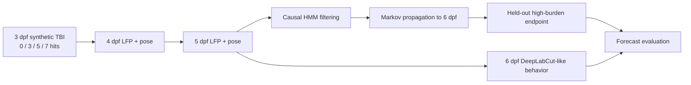

# Larval Zebrafish TBI Markov Modeling

[](https://github.com/josephreggy23-coder/Latent-Period-Epileptogenesis-Assessment-Via-Markov-Modeling/actions/workflows/ci.yml)


An installable, fully tested computational-neuroscience benchmark for modeling
early post-traumatic electrophysiological dynamics in larval zebrafish.

The repository simulates a syringe-blast traumatic brain injury (TBI) at
3 days post fertilization (dpf), records synthetic local field potential (LFP)
and pose-derived behavior at 4–6 dpf, and fits a hidden Markov model (HMM) with
both worsening and recovery transitions. The primary held-out task forecasts a
6 dpf high-burden state using only the uninterrupted, QC-passing 4–5 dpf LFP
prefix.

**The same pipeline runs on a real recording.** A measured 240-fish weight-drop
TBI dataset following the identical design is normalized into the same tables
and analyzed by the same model — see [Real data](#real-data). Synthetic and real
rows can never be mixed: every table carries an `is_synthetic` flag that the
loader checks in both directions.


## Benchmark at a glance

| Component | Seed-42 benchmark |
|---|---:|
| Synthetic larvae | 240, 60 per arm |
| Injury arms | sham and 3/5/7 repeated hits |
| LFP/behavior sessions | 706 at 4–6 dpf |
| QC-passing sessions | 683 (96.7%) |
| Contiguous model sessions | 662 from 231 fish |
| Selected statistical microstates | 4, mapped to 3 severity macrostates |
| Held-out DPF6 forecast cohort | 68 fish, 12 positives |
| ROC-AUC | 0.864 (95% bootstrap CI 0.758–0.945) |
| Average precision / Brier score | 0.489 / 0.104 |
| Held-out planted-state balanced accuracy | 1.000 |

Perfect planted-state recovery is a simulator check, not a biological result.
The forward endpoint forecast is the more meaningful benchmark.


### Real recording, same pipeline

| Component | Real dataset |
|---|---:|
| Recorded larvae | 240, 60 per arm |
| Injury arms | sham, `tbi_low`, `tbi_moderate`, `tbi_high` |
| LFP sessions at 4–6 dpf | 706 |
| QC-passing sessions | 706 (100%) |
| Contiguous model sessions | 706 from 240 fish |
| Endpoint resolved / unobserved | 233 fish / 7 fish (`NA`) |
| Held-out DPF6 forecast cohort | 71 fish, 19 positives |
| ROC-AUC | 0.749 (95% bootstrap CI 0.642–0.853) |
| Average precision / Brier score | 0.438 / 0.206 |
| Held-out planted-state balanced accuracy | **not measurable** |

State recovery has no real-data counterpart: real animals carry no planted
latent state, so the analysis returns `state_recovery: null` rather than a
proxy. Full report: [`results_real/TBI_MODEL_RESULTS.md`](results_real/TBI_MODEL_RESULTS.md).

## Experimental and analysis flow



## Repository layout

```text
.
├── .github/workflows/ci.yml       continuous integration
├── data/
│   ├── README.md                  data provenance and schema guide
│   ├── synthetic/                 normalized CSVs, manifest, workbook
│   └── real/                      normalized real recording + manifest
├── docs/
│   ├── EXPERIMENTAL_PROTOCOL.md   wet-lab protocol, apparatus, calibration
│   ├── METHODS.md                 experimental and statistical methods
│   └── REPRODUCIBILITY.md         deterministic workflow and safeguards
├── results/
│   ├── figures/                   publication-ready diagnostic figures
│   ├── tables/                    scored sessions and summary tables
│   ├── TBI_MODEL_RESULTS.md       human-readable benchmark report
│   └── tbi_model_metrics.json     machine-readable metrics
├── results_real/                  same outputs for the real recording
├── scripts/                       lightweight command-line wrappers
├── src/tbi_markov/                installable analysis package
├── tests/                         simulator, HMM, leakage, and smoke tests
├── CITATION.cff
├── CONTRIBUTING.md
├── pyproject.toml
└── README.md
```

## Installation

Python 3.10 or newer is required.

```bash
git clone https://github.com/josephreggy23-coder/Latent-Period-Epileptogenesis-Assessment-Via-Markov-Modeling.git
cd Latent-Period-Epileptogenesis-Assessment-Via-Markov-Modeling
python -m venv .venv

# Activate the environment:
# Windows: .venv\Scripts\activate
# macOS/Linux: source .venv/bin/activate

python -m pip install --upgrade pip
python -m pip install -e ".[dev]"
```

## Reproduce the benchmark

Run the complete deterministic workflow:

```bash
python -m tbi_markov
```

Equivalent installed commands are:

```bash
tbi-generate --seed 42 --n-per-arm 60
tbi-analyze
tbi-pipeline
```

The stages can also be invoked from `scripts/`:

```bash
python scripts/generate_dataset.py --seed 42 --n-per-arm 60
python scripts/run_analysis.py
python scripts/run_pipeline.py
```

The generator rewrites the normalized CSV tables and manifest under
`data/synthetic/`. The formatted Excel workbook is the committed human-readable
snapshot of the default seed-42 cohort; the CSV tables and manifest are
authoritative after a custom run.

## Real data

A real 240-fish weight-drop TBI recording follows the same experimental design
as the simulator — 3 dpf injury, LFP at 4/5/6 dpf, sham plus three doses — and
supplies all seven HMM features. It is ingested by:

```bash
tbi-real
# or: python scripts/run_real_analysis.py
```

This normalizes the source workbooks into `data/real/`, then runs the **same**
model, preprocessing, causal 4–5 dpf prefix rule, and 6 dpf propagation used by
the synthetic benchmark. Results land in `results_real/`.

Source workbooks (expected at the repository root):

| File | Sheet | Contents |
|---|---|---|
| `actualdata1(lfp).xlsx` | `LFP Recordings` | one row per fish-session |
| `actualdata(behavioral).xlsx` | `Behavioral Outcomes` | one row per fish |
| `actualdata(behavioral).xlsx` | `Event Log` | one row per scored behavioral event |

### Three real differences, none of them hidden

1. **No planted latent state.** There is no `hidden_state_TRUTH` column, so
   held-out state recovery is *unmeasurable*, not merely unreported. The
   analysis returns `state_recovery: null`, and the confusion-matrix figure is
   skipped rather than faked.
2. **The endpoint is behavioral, and three-valued.** A fish is positive if the
   blinded scorer logged at least one qualifying event (Baraban stage ≥ 2 with
   passing pose QC) in the 6 dpf session, negative if it was observed at 6 dpf
   with no such event, and **`NA` if it was never observed at 6 dpf** — 7 fish
   here. An unobserved animal has an unknown outcome, not a negative one;
   coding absence as 0 would pad the negative class with animals nobody checked.
   The endpoint shares no variable with the LFP feature matrix, so the forecast
   target stays independent of the model's inputs.
3. **Behavior is per-event.** The Event Log lists scored events; sessions with
   none are absent. They are materialized as zero-event rows rather than
   dropped, because "no scored behavior" is an observation. Dropping them would
   restrict the validation to the abnormal subset and bias it.

### Honest reading of the real result

The forecast **discriminates** (AUC 0.749, 95% CI 0.642–0.853) but is **poorly
calibrated** against this endpoint: the median forecast risk is 0.037 and only 4
of 71 held-out fish exceed the fixed 0.5 threshold, so sensitivity at that
threshold is 0.105. The propagated quantity is the probability of occupying the
top *LFP* macrostate, while the endpoint is a *behavioral* event — different
scales, so the risk sits below 0.5 for most animals. Any deployment would need a
threshold fitted on training fish; none is tuned on the held-out set. The
metrics record the observed positive rate next to the mean, median, and maximum
forecast risk, so this is checkable rather than asserted.

Inferred risk does track injury dose (Spearman ρ = 0.623, p = 6×10⁻⁹) without
the endpoint entering the model.

## Experimental protocol

The wet-lab methodology this repository models is specified in full in
**[docs/EXPERIMENTAL_PROTOCOL.md](docs/EXPERIMENTAL_PROTOCOL.md)** — apparatus,
pressure calibration, plate layout, imaging, pose estimation, LFP acquisition,
and required metadata.

> **This is a new integrated protocol, not a replication.** No published study
> has run this exact combined experiment. Locskai et al. recorded acute behavior
> after TBI at 6 dpf and used a 3 dpf injury for a 7 dpf tau endpoint; Eimon et
> al. demonstrated penetrating forebrain LFP at 7 dpf; the high-speed pose study
> examined PTZ and genetic seizures at 3, 5, and 7 dpf. **3 dpf TBI followed by
> longitudinal 4–6 dpf LFP and behavior integrates three published methods and
> requires a pilot study.**

### Real apparatus (as recorded in `data/real/`)

| Parameter | Value |
|---|---|
| Fish | Wild-type AB larvae, 28 °C, 14 h/10 h light cycle, E3 |
| Injury | 3 dpf, **single** drop from 108 cm |
| Syringe / holder | 20 mL BD Luer-Lok in a three-prong clamp, 1.0 mL E3 |
| Arms | Sham (0 g), 100 g, 200 g, 300 g |
| Measured peak pressure | 0 / 115 / 210 / 319 kPa |
| Recording | 24, 48, 72 h post-insult (4, 5, 6 dpf) |
| Replicates | 6 clutches, 3 recording batches |

Note this differs from the **synthetic** simulator below, which models 3/5/7
*repeated* hits at a 195 kPa nominal center in a 10 mL syringe. The two
apparatus descriptions are not interchangeable.

Locskai reported behavioral seizure phenotypes at roughly 90–300 kPa, with
pressures above ≈ 300 kPa suppressing gross locomotion — so **low movement in
the 300 g arm cannot be read as absence of seizures.**

### Three constraints that bound the real-data claims

1. **Longitudinal penetrating LFP is unvalidated.** The electrode metadata
   (`forebrain` target, 1 M chloride, 2.45–3.57 MΩ) matches Eimon's penetrating
   preparation and its ≈ 3 MΩ stop criterion — yet 228 fish have all three daily
   sessions. That method was demonstrated at 7 dpf and **was not validated as a
   recoverable, repeated measurement in the same larva at 4, 5, and 6 dpf.**
   Under the protocol, that combination is the case calling for independent
   terminal cohorts, in which individual longitudinal state transitions should
   not be claimed. A Markov model over per-fish daily transitions presupposes
   the opposite. **This is the single most important thing a pilot must settle**,
   and no amount of modeling can resolve it.
2. **Seizure timing is interval-censored.** Behavior is scored in three discrete
   sessions, so any reconstructed latency is a *first observed* time, not a
   first-occurrence time. The repository therefore scores presence of a
   qualifying event in the 6 dpf session rather than a continuous latency.
3. **`insult_batch_id` is absent.** The protocol makes the independent
   syringe/drop batch the experimental unit, with larvae nested inside it. That
   identifier is not in the dataset, so drop batch cannot enter the model as a
   grouping variable; only clutch and recording batch can.

## Methods summary

### Synthetic TBI design

The apparatus is held constant at a 10 mL syringe, three-prong clamp, 200 g
weight, and 108 cm height. Only the repeated-hit count varies:

| Arm | Hits | Nominal per-hit pressure |
|---|---:|---:|
| `sham` | 0 | 0 kPa |
| `tbi_low` | 3 | 195 kPa |
| `tbi_moderate` | 5 | 195 kPa |
| `tbi_high` | 7 | 195 kPa |

The 195 kPa center is a simulator assumption inside the approximately
90–300 kPa behavioral-seizure range reported by Locskai et al.; it is not an
experimental group mean. `cumulative_pressure_burden_kpa_hits` is a synthetic
kPa-hits dose index, not a measured pressure integral.

### LFP feature interface

The HMM receives only seven Eimon-inspired session summaries:

```text
lfp_mean_uv
lfp_variance_uv2
lfp_skewness
lfp_kurtosis
lfp_fourth_power_mean_uv4
lfp_seizure_event_rate_per_h
lfp_ica_complexity
```

Group, dose, pressure, batch, QC metadata, behavior, and every `*_TRUTH` field
are excluded from the feature matrix. Positive heavy-tailed features receive a
`log1p` transform; median/IQR scaling is fit on training fish only.

### Leakage and temporal safeguards

- The 70%/30% partition is made at the fish level.
- The split is stratified by arm and planted endpoint, but the endpoint never
  enters HMM fitting.
- A failed or missing session terminates the uninterrupted 4 dpf-based prefix;
  a 4-to-6 dpf gap is never compressed into one Markov step.
- Model selection uses training data only.
- Held-out state recovery is scored only after fitting.
- The DPF6 forecast filters the available 4–5 dpf prefix and propagates the
  resulting state distribution through the learned transition matrix.
- DeepLabCut-like behavior is an independent validation channel, never an HMM
  input.

See [Methods](docs/METHODS.md) for the complete protocol and
[Reproducibility](docs/REPRODUCIBILITY.md) for implementation safeguards.

## Tests

```bash
python -m pytest
```

The test suite covers deterministic generation, schema/QC rules, manifest
hashes, feature isolation, fish-level splitting, contiguous sequence handling,
HMM normalization and recovery, causal prefix invariance, Markov propagation,
an end-to-end smoke run, and the real-data contract — including that a synthetic
load rejects measured rows, a real load rejects simulated rows, and state
recovery reports absence rather than a proxy when no planted truth exists. Real
workbook tests skip automatically when the source files are not present.

## Scientific boundaries

### Synthetic benchmark

- The exact repeated 4–6 dpf same-fish LFP schedule is hypothetical.
- Eimon et al. studied 7 dpf `scn1lab` larvae, not TBI larvae.
- DeepLabCut-like values were generated without videos or a trained network.
- The hidden states and DPF6 endpoint are planted simulator constructs.
- Synthetic benchmark numbers are not evidence of post-traumatic epilepsy or
  treatment efficacy.

### Real recording

- **Repeated penetrating forebrain LFP in the same larva at 4–6 dpf is not a
  validated preparation** — see constraint 1 above. Longitudinal per-fish state
  transitions rest on an assumption this dataset cannot verify.
- The combined 3 dpf TBI → 4–6 dpf LFP + behavior protocol is a new integration
  of three published methods and has not itself been published or piloted.
- Three sessions per fish is a short series for a Markov model: the transition
  matrix rests on at most two observed steps per animal.
- The drop batch, which the protocol defines as the experimental unit, is not
  identified in the data, so larvae from one impact cannot be treated as the
  nested observations they are.
- Pressures above ≈ 300 kPa can suppress locomotion, so reduced movement in the
  highest-dose arm is ambiguous between "no seizure" and "too injured to move".
- A single seizure is not chronic epilepsy: the endpoint is an operational
  early post-traumatic seizure outcome, not post-traumatic epilepsy.
- No planted latent state exists, so state recovery is unmeasurable and the
  latent states are validated only indirectly, through the forward forecast and
  the independent behavioral channel.
- Behavior is scored in three discrete sessions, so event timing is
  interval-censored.
- The abnormality index uses only event-rate and stage terms, which stay defined
  when the scorer logged nothing; kinematic columns are reported but excluded
  from the index because imputing them for zero-event sessions would manufacture
  signal.
- One forebrain electrode per fish bounds the available information.
- The result is a single cohort analyzed retrospectively; it is not a
  prospective clinical claim.

## Primary references

1. Locskai LF, Gill T, Tan SAW, et al. *A larval zebrafish model of traumatic
   brain injury: optimizing the dose of neurotrauma for discovery of treatments
   and aetiology.* Biology Open. 2025;14(2):bio060601.
   [doi:10.1242/bio.060601](https://doi.org/10.1242/bio.060601)
2. Eimon PM, Ghannad-Rezaie M, De Rienzo G, et al. *Brain activity patterns in
   high-throughput electrophysiology screen predict both drug efficacies and
   side effects.* Nature Communications. 2018;9:219.
   [doi:10.1038/s41467-017-02404-4](https://doi.org/10.1038/s41467-017-02404-4)
3. Mathis A, Mamidanna P, Cury KM, et al. *DeepLabCut: markerless pose
   estimation of user-defined body parts with deep learning.* Nature
   Neuroscience. 2018;21:1281–1289.
   [doi:10.1038/s41593-018-0209-y](https://doi.org/10.1038/s41593-018-0209-y)
4. Nath T, Mathis A, Chen AC, et al. *Using DeepLabCut for 3D markerless pose
   estimation across species and behaviors.* Nature Protocols.
   2019;14:2152–2176.
   [doi:10.1038/s41596-019-0176-0](https://doi.org/10.1038/s41596-019-0176-0)
5. Whyte-Fagundes P, et al. *High-speed pose estimation of larval zebrafish
   seizure behavior.* Communications Biology. 2025.
   [doi:10.1038/s42003-025-08310-6](https://doi.org/10.1038/s42003-025-08310-6)
6. Hong S, et al. *iZAP: non-invasive zebrafish electrophysiology.* Scientific
   Reports. 2016;6:28248.
   [doi:10.1038/srep28248](https://doi.org/10.1038/srep28248)
7. Baraban SC, Taylor MR, Castro PA, Baier H. *Pentylenetetrazole induced
   changes in zebrafish behavior, neural activity and c-fos expression.*
   Neuroscience. 2005;131(3):759–768.
   [doi:10.1016/j.neuroscience.2004.11.031](https://doi.org/10.1016/j.neuroscience.2004.11.031)

## Citation

Use the repository metadata in [CITATION.cff](CITATION.cff). Cite the simulator,
its dataset, and its results as a **synthetic computational benchmark**; cite the
real-recording analysis as a **retrospective single-cohort analysis**, not as a
prospective or clinical finding. The two must not be conflated.
